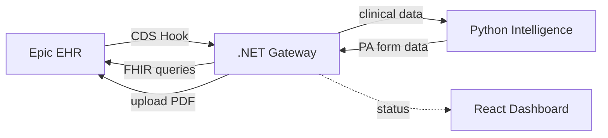
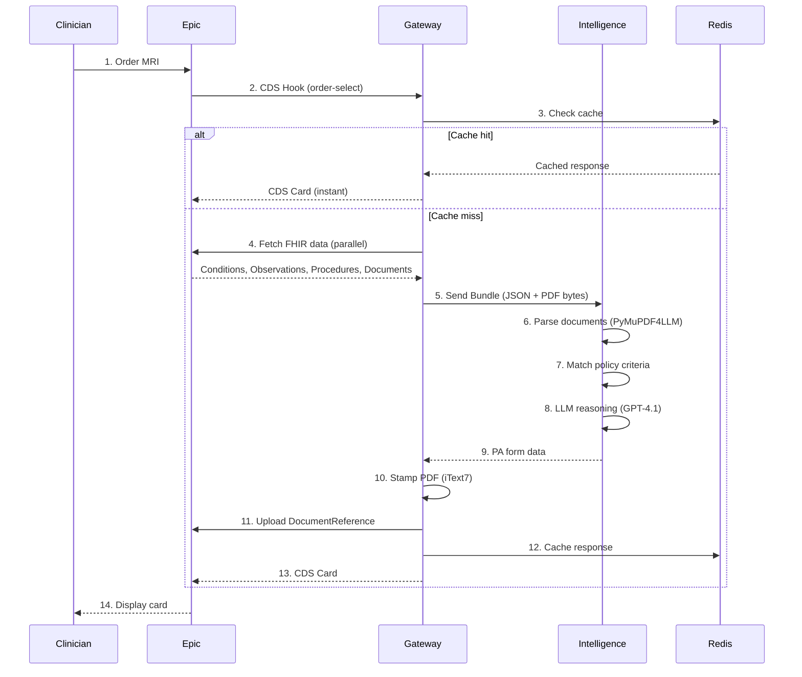

# AuthScript Architecture Overview

This document provides an architectural overview for developers joining the AuthScript project.

## System Architecture



### Component Responsibilities

| Component | Role |
|-----------|------|
| **Epic EHR** | Triggers CDS hooks, provides FHIR data, receives completed forms |
| **Gateway** | Orchestrates flow, aggregates FHIR data, stamps PDFs |
| **Intelligence** | Parses policies, reasons with LLM, generates form data |
| **Dashboard** | Displays status, evidence, and form preview |

## Hybrid Data Pipeline

The Gateway acts as a **Data Aggregator**, fetching high-confidence structured data (Conditions, Observations) to supplement lower-confidence unstructured data (PDFs) before sending both to the Intelligence Service.

### Truth Hierarchy

When structured FHIR data conflicts with unstructured document text:

```
Priority 1: Structured FHIR Data (Exact Match)
   ↓ If missing
Priority 2: Unstructured Data (LLM Inference from PDFs)
   ↓ If conflicting
Priority 3: Flag for manual review
```

## Request Flow



## Project Structure

```
prior-auth/
├── apps/
│   ├── gateway/                  # .NET 10 - CDS Hooks, FHIR, PDF
│   │   ├── Gateway.API/
│   │   │   ├── Contracts/        # Interface definitions
│   │   │   │   └── Fhir/         # FHIR abstraction layer
│   │   │   ├── Endpoints/        # Minimal API endpoints
│   │   │   ├── Models/           # DTOs and domain models
│   │   │   └── Services/         # Implementation classes
│   │   │       └── Fhir/         # FHIR client implementations
│   │   └── Gateway.API.Tests/
│   ├── intelligence/             # Python - LLM reasoning
│   │   └── src/
│   └── dashboard/                # React 19 - UI + SMART app
│       └── src/
├── orchestration/
│   └── AuthScript.AppHost/       # .NET Aspire orchestration
├── shared/
│   ├── types/                    # Shared TypeScript types
│   └── validation/               # Zod schemas
├── scripts/
│   └── build/                    # Build scripts
├── docs/
│   └── designs/                  # Architecture decision records
└── assets/
    └── pdf-templates/            # PA form templates
```

## Technology Stack

| Component | Technology | Purpose |
|-----------|------------|---------|
| **Gateway** | .NET 10, iText7, Polly | Epic integration, PDF generation, resilience |
| **Intelligence** | Python 3.11, FastAPI, PyMuPDF4LLM | Clinical reasoning, PDF extraction |
| **Dashboard** | React 19, Vite, TanStack Router/Query | Shadow dashboard + SMART fallback |
| **Orchestration** | .NET Aspire | Local dev environment |
| **Database** | PostgreSQL | Audit logs, vector storage |
| **Cache** | Redis | Demo response caching |

## Getting Started

### Prerequisites

- .NET 10 SDK
- Node.js 20+
- Docker Desktop or Podman Desktop (required for containerized services)

### Development Setup

```bash
# Install dependencies
npm install
npm run build:shared

# Start all services via Aspire (Docker must be running)
npm run dev
```

### Schema Synchronization

When API contracts change:

```bash
npm run sync:schemas
```

This generates:
- TypeScript types from OpenAPI specs
- Zod validation schemas
- React Query hooks

## Environment Variables

| Variable | Service | Description |
|----------|---------|-------------|
| `Epic__ClientId` | Gateway | Epic Launchpad client ID |
| `Epic__FhirBaseUrl` | Gateway | FHIR R4 endpoint |
| `LLM_PROVIDER` | Intelligence | LLM provider: `github`, `azure`, `gemini` |
| `GITHUB_TOKEN` | Intelligence | GitHub Models access (default) |
| `Demo__EnableCaching` | Gateway | Enable Redis caching |

## Testing Strategy

| Layer | Framework | Coverage Target |
|-------|-----------|-----------------|
| Gateway | TUnit | Services, endpoints |
| Intelligence | pytest | Evidence extraction, form generation |
| Dashboard | Vitest | Components, hooks |
| E2E | (manual) | Epic sandbox integration |

## Audit Logging

The system records which source provided each data field:
- `Source: FHIR Condition/123` — Structured data (high confidence)
- `Source: LLM Inference` — Extracted from unstructured documents
