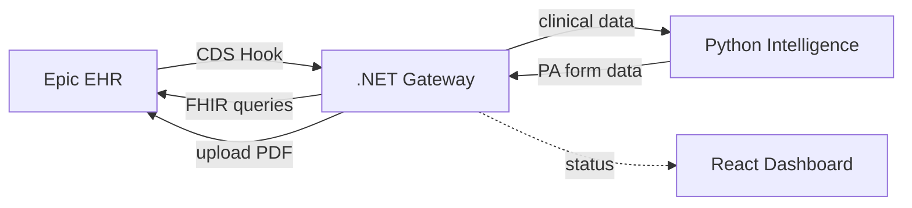
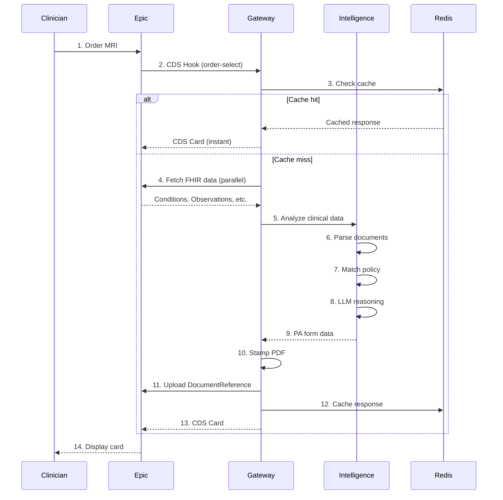

# AuthScript Architecture Overview

This document provides an architectural overview for developers joining the AuthScript project.

## System Architecture



### Component Responsibilities

| Component | Role |
|-----------|------|
| **Epic EHR** | Triggers CDS hooks, provides FHIR data, receives completed forms |
| **Gateway** | Orchestrates flow, aggregates FHIR data, stamps PDFs |
| **Intelligence** | Parses policies, reasons with LLM, generates form data |
| **Dashboard** | Displays status, evidence, and form preview |

## Request Flow



## Project Structure

```
prior-auth/
├── apps/
│   ├── gateway/              # .NET 8 - CDS Hooks, FHIR, PDF
│   │   └── src/Gateway.API/
│   ├── intelligence/         # Python - LLM reasoning
│   │   └── src/
│   └── dashboard/            # React 19 - UI + SMART app
│       └── src/
├── orchestration/
│   └── AuthScript.AppHost/   # .NET Aspire orchestration
├── shared/
│   ├── types/                # Shared TypeScript types
│   └── validation/           # Zod schemas
├── scripts/
│   └── build/                # Build scripts
└── assets/
    └── pdf-templates/        # PA form templates
```

## Technology Stack

| Component | Technology | Purpose |
|-----------|------------|---------|
| **Gateway** | .NET 8, Firely SDK, iText7 | Epic integration, PDF generation |
| **Intelligence** | Python 3.11, FastAPI, LangChain | Clinical reasoning, LLM orchestration |
| **Dashboard** | React 19, Vite, TanStack | Shadow dashboard + SMART fallback |
| **Orchestration** | .NET Aspire | Local dev environment |
| **Database** | PostgreSQL | Audit logs, vector storage |
| **Cache** | Redis | Demo response caching |

## Getting Started

### Prerequisites

- .NET 8 SDK
- Node.js 20+
- Python 3.11+ with `uv`
- Docker (for Aspire containers)

### Development Setup

```bash
# Install dependencies
npm install
cd apps/intelligence && uv sync && cd ../..

# Start all services via Aspire
npm run dev

# Or start individually:
npm run dev:dashboard      # React dashboard
npm run dev:intelligence   # Python API
dotnet run --project apps/gateway/src/Gateway.API
```

### Schema Synchronization

When API contracts change:

```bash
npm run sync:schemas
```

This generates:
- TypeScript types from OpenAPI specs
- Zod validation schemas
- React Query hooks

## Key Design Decisions

### 1. Bulletproof Happy Path
- Single procedure (MRI Lumbar), single payer (Blue Cross)
- Pre-validated Synthea patients
- Aggressive caching for sub-2s responses

### 2. CDS Hooks over SMART-only
- Lower friction for clinicians
- Appears in workflow without launching app
- SMART app as fallback only

### 3. Separate Intelligence Service
- Python ecosystem for LLM tooling
- LangChain/LlamaIndex compatibility
- Independent scaling

### 4. Gateway as Orchestrator
- Single entry point for Epic
- Handles timeout management
- PDF generation in .NET (iText7 maturity)

## Environment Variables

| Variable | Service | Description |
|----------|---------|-------------|
| `Epic__ClientId` | Gateway | Epic Launchpad client ID |
| `Epic__FhirBaseUrl` | Gateway | FHIR R4 endpoint |
| `OPENAI_API_KEY` | Intelligence | GPT-4o access |
| `LLAMA_CLOUD_API_KEY` | Intelligence | LlamaParse access |
| `Demo__EnableCaching` | Gateway | Enable Redis caching |

## Testing Strategy

| Layer | Framework | Coverage Target |
|-------|-----------|-----------------|
| Gateway | TUnit | Services, endpoints |
| Intelligence | pytest | Evidence extraction, form generation |
| Dashboard | Vitest | Components, hooks |
| E2E | (manual) | Epic sandbox integration |
