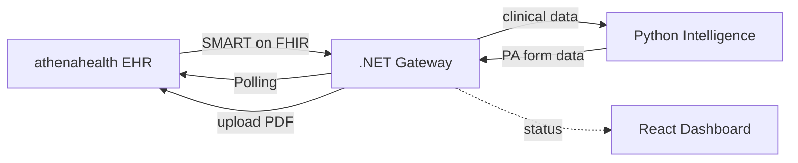
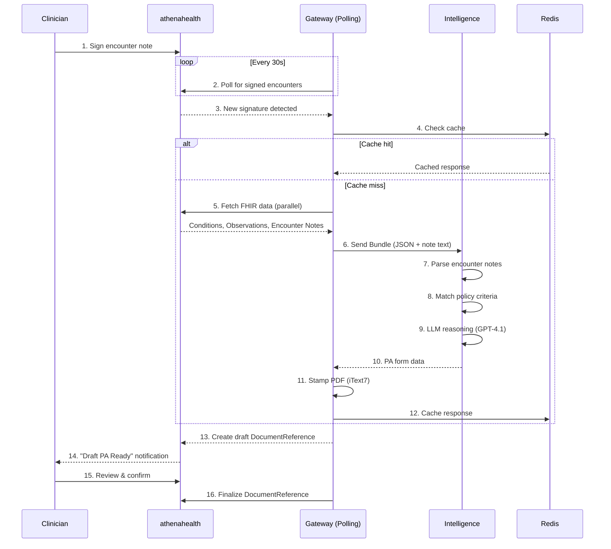

# AuthScript Architecture Overview

This document provides an architectural overview for developers joining the AuthScript project.

## System Architecture



### Component Responsibilities

| Component | Role |
|-----------|------|
| **athenahealth** | Source of encounter data, receives completed PA forms |
| **Gateway** | Polls for signatures, orchestrates flow, aggregates FHIR data, stamps PDFs |
| **Intelligence** | Parses policies, reasons with LLM, generates form data |
| **Dashboard** | Displays PA queue, evidence, form preview, doctor review |

## The 5-Step Workflow

AuthScript automates prior authorization for independent family practices through a streamlined workflow:

```
┌─────────┐    ┌─────────┐    ┌─────────┐    ┌─────────┐    ┌─────────┐
│  DRAFT  │───▶│ DETECT  │───▶│ PROCESS │───▶│ DELIVER │───▶│ REVIEW  │
│         │    │         │    │         │    │         │    │         │
│ Doctor  │    │Signature│    │AI reads │    │Draft PA │    │ Doctor  │
│ signs   │    │detected │    │& maps   │    │ready in │    │confirms │
│encounter│    │via poll │    │to rules │    │ sidebar │    │& submit │
└─────────┘    └─────────┘    └─────────┘    └─────────┘    └─────────┘
```

### Step Details

1. **Draft**: Doctor treats the patient and signs the encounter note in athenahealth
2. **Detect**: AuthScript detects the signature instantly via polling (30-second intervals)
3. **Process**: AI reads unstructured notes, maps medical necessity to payer rules, fills PDF
4. **Deliver**: A "Draft PA Request" notification appears in the patient's chart sidebar
5. **Review**: Doctor clicks one button to review and confirm. PDF is written back to chart

## Hybrid Data Pipeline

The Gateway acts as a **Data Aggregator**, fetching high-confidence structured data (Conditions, Observations) to supplement lower-confidence unstructured data (encounter notes) before sending both to the Intelligence Service.

### Truth Hierarchy

When structured FHIR data conflicts with unstructured document text:

```
Priority 1: Structured FHIR Data (Exact Match)
   ↓ If missing
Priority 2: Unstructured Data (LLM Inference from Notes)
   ↓ If conflicting
Priority 3: Flag for manual review
```

## Request Flow



## Dashboard API (GraphQL)

The dashboard communicates with the Gateway via **GraphQL** at `/api/graphql`. This replaces the previous REST + localStorage mock approach.

| Operation | GraphQL | Purpose |
|-----------|---------|---------|
| List PA requests | `query { paRequests { ... } }` | Dashboard queue |
| Get PA request | `query { paRequest(id: "...") { ... } }` | Analysis detail page |
| Get stats | `query { paStats { ... } }` | Stats cards |
| Get activity | `query { activity { ... } }` | Recent activity feed |
| Reference data | `query { procedures, medications, providers, payers, diagnoses }` | New PA modal |
| Create PA | `mutation { createPARequest(input: {...}) { ... } }` | New PA flow |
| Process PA | `mutation { processPARequest(id: "...") { ... } }` | Simulate AI processing |
| Update PA | `mutation { updatePARequest(input: {...}) { ... } }` | Edit form data |
| Submit PA | `mutation { submitPARequest(id: "...") { ... } }` | Mark as submitted |

Mock data (patients, procedures, medications, payers, providers, diagnoses, PA requests) is stored in the backend `MockDataService` and served via GraphQL. The REST `/api/analysis` endpoints remain for the SMART app / transaction-based flow.

## Project Structure

```
authscript/
├── apps/
│   ├── gateway/                  # .NET 10 - Polling, FHIR, PDF
│   │   ├── Gateway.API/
│   │   │   ├── Contracts/        # Interface definitions
│   │   │   │   └── Fhir/         # FHIR abstraction layer
│   │   │   ├── Endpoints/        # Minimal API endpoints
│   │   │   ├── GraphQL/         # GraphQL schema, queries, mutations
│   │   │   ├── Models/           # DTOs and domain models
│   │   │   └── Services/         # Implementation classes
│   │   │       └── Fhir/         # athenahealth FHIR client
│   │   └── Gateway.API.Tests/
│   ├── intelligence/             # Python - LLM reasoning
│   │   └── src/
│   └── dashboard/                # React 19 - PA queue + review UI
│       └── src/
│           ├── api/              # GraphQL client, authscriptService (REST)
│           ├── components/       # UI components
│           │   ├── WorkflowProgress.tsx
│           │   ├── PARequestCard.tsx
│           │   ├── EvidencePanel.tsx
│           │   └── FormPreview.tsx
│           └── routes/           # Page routes
├── orchestration/
│   └── AuthScript.AppHost/       # .NET Aspire orchestration
├── shared/
│   ├── types/                    # Shared TypeScript types
│   └── validation/               # Zod schemas
├── scripts/
│   └── build/                    # Build scripts
├── docs/
│   └── designs/                  # Architecture decision records
└── assets/
    └── pdf-templates/            # PA form templates
```

## Technology Stack

| Component | Technology | Purpose |
|-----------|------------|---------|
| **Gateway** | .NET 10, iText7, Polly | athenahealth integration, PDF generation, resilience |
| **Intelligence** | Python 3.11, FastAPI, PyMuPDF4LLM | Clinical reasoning, note extraction |
| **Dashboard** | React 19, Vite, TanStack Router/Query | PA queue, review workflow |
| **Orchestration** | .NET Aspire | Local dev environment |
| **Database** | PostgreSQL | Audit logs, vector storage |
| **Cache** | Redis | Response caching |

## Getting Started

### Prerequisites

- .NET 10 SDK
- Node.js 20+ (22.18+ recommended)
- Docker Desktop or Podman Desktop (required for containerized services)

### Development Setup

```bash
# Install dependencies
npm install
npm run build:shared

# Start all services via Aspire (Docker must be running)
npm run dev
```

### Schema Synchronization

When API contracts change:

```bash
npm run sync:schemas
```

This generates:
- TypeScript types from OpenAPI specs
- Zod validation schemas
- React Query hooks

## Environment Variables

| Variable | Service | Description |
|----------|---------|-------------|
| `Athena__ClientId` | Gateway | athenahealth SMART client ID |
| `Athena__FhirBaseUrl` | Gateway | FHIR R4 endpoint |
| `Athena__PollIntervalSeconds` | Gateway | Signature polling interval (default: 30) |
| `LLM_PROVIDER` | Intelligence | LLM provider: `github`, `azure`, `gemini` |
| `GITHUB_TOKEN` | Intelligence | GitHub Models access (default) |
| `Demo__EnableCaching` | Gateway | Enable Redis caching |

## Testing Strategy

| Layer | Framework | Coverage Target |
|-------|-----------|-----------------|
| Gateway | TUnit | Services, endpoints, polling |
| Intelligence | pytest | Evidence extraction, form generation |
| Dashboard | Vitest | Components, hooks, workflow |
| E2E | (manual) | athenahealth sandbox integration |

## Audit Logging

The system records which source provided each data field:
- `Source: FHIR Condition/123` — Structured data (high confidence)
- `Source: LLM Inference` — Extracted from encounter notes (flagged for review if low confidence)

## Target Market

AuthScript is designed for **independent family practices** using athenahealth who:
- Handle significant prior authorization volume
- Want to reduce administrative burden
- Need a simple one-click review workflow
- Value automation that stays under physician control

## SMART on FHIR Integration

AuthScript uses SMART on FHIR for secure athenahealth integration:

1. **Standalone Launch**: Dashboard can launch independently
2. **EHR Launch**: Embedded in athenahealth patient chart sidebar
3. **Polling Service**: Background service monitors for signed encounters
4. **Scopes**: `patient/*.read`, `DocumentReference.write`
