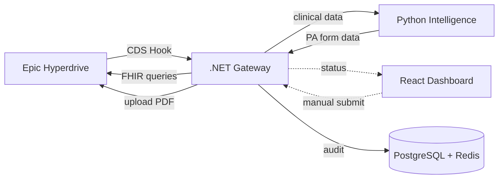
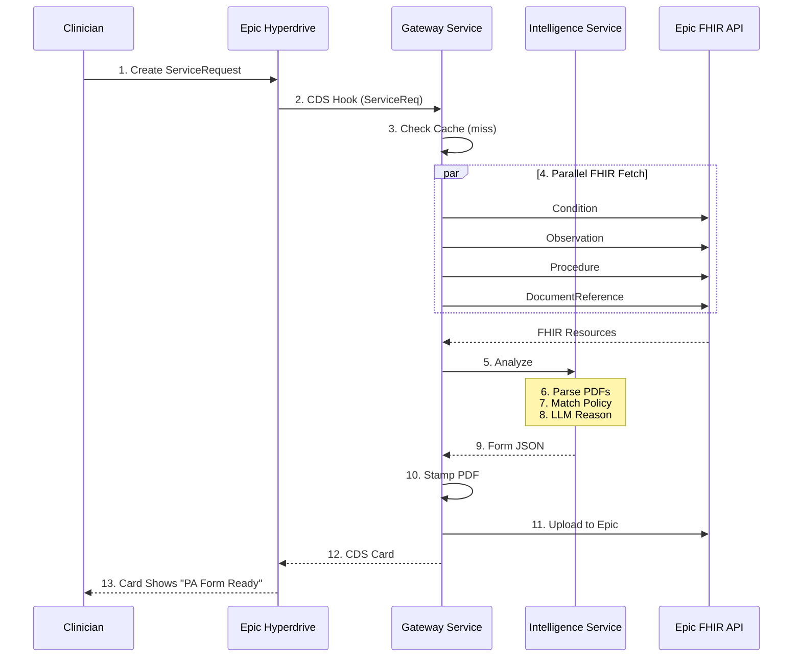
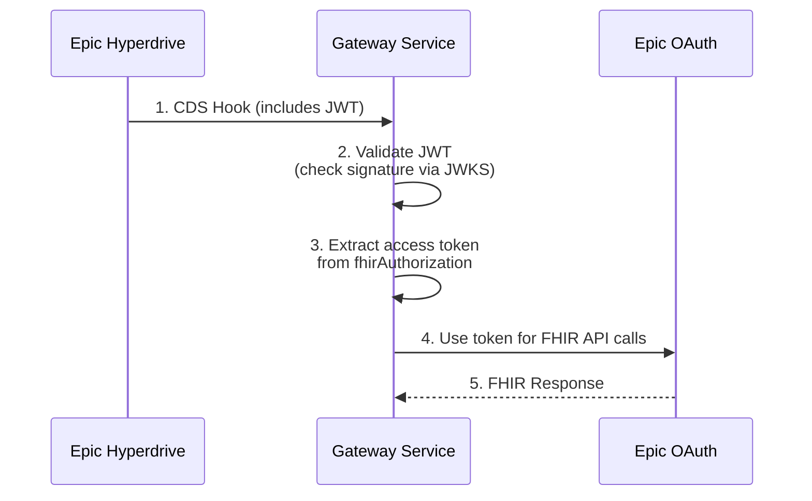
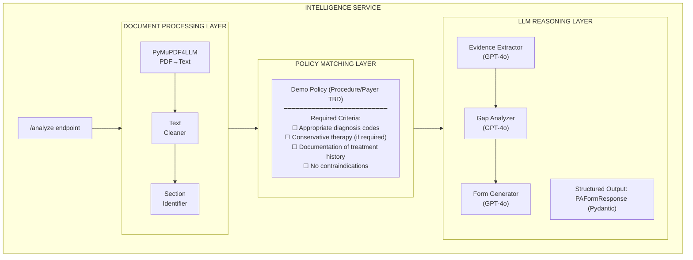
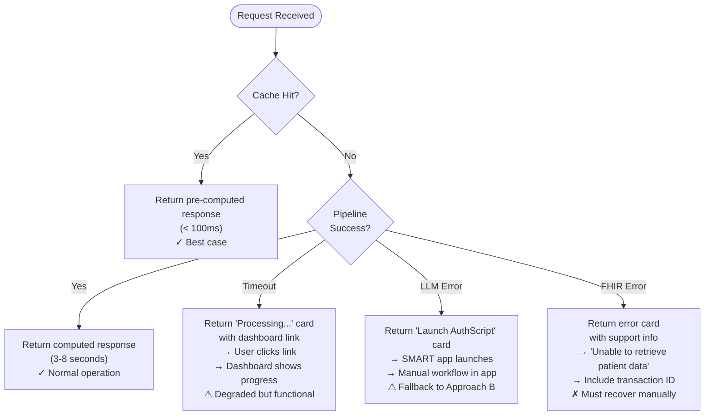
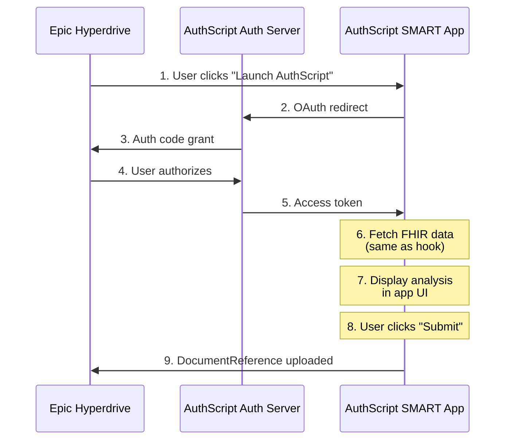

# AuthScript Demo Architecture Design

**Feature:** AI-Powered Prior Authorization Demo for CSE 589 Final Pitch
**Date:** 2025-01-21
**Status:** Draft
**Author:** AuthScript Team

---

> **Disclaimer:** This document was AI-generated and has been copyedited for accuracy. Some implementation details may be outdated or incorrect. Please verify technical specifics against actual code and current requirements when implementing.

## Executive Summary

AuthScript is an AI-native prior authorization solution that integrates directly into Epic's clinical workflow via CDS Hooks. For the March 11, 2026 VC pitch at Pioneer Square Labs, we will demonstrate a **live, end-to-end** workflow where a physician creates a ServiceRequest in Epic Hyperdrive, and AuthScript automatically:

1. Detects the order via CDS Hooks
2. Aggregates structured FHIR data and unstructured clinical documents
3. Reasons against payer policy using GPT-4o
4. Generates a completed prior authorization form
5. Uploads the form back to Epic

The architecture follows a **"Bulletproof Happy Path"** philosophy: narrow scope (procedure TBD, payer TBD), pre-validated scenarios, aggressive caching, and graceful fallbacks. A SMART on FHIR app serves as both the "Shadow Dashboard" for demo visibility and a manual fallback if the automated flow encounters issues.

---

## Table of Contents

1. [Architecture Overview](#1-architecture-overview)
2. [Component Specifications](#2-component-specifications)
3. [Epic Integration Strategy](#3-epic-integration-strategy)
4. [Intelligence Service Design](#4-intelligence-service-design)
5. [Data Strategy](#5-data-strategy)
6. [Demo Reliability Engineering](#6-demo-reliability-engineering)
7. [Fallback Architecture (SMART App)](#7-fallback-architecture-smart-app)
8. [Security & Compliance](#8-security--compliance)
9. [Implementation Roadmap](#9-implementation-roadmap)
10. [Risk Register](#10-risk-register)
11. [Implementation Status & Strategic Recommendations](#11-implementation-status--strategic-recommendations)

---

## 1. Architecture Overview

### 1.1 System Context Diagram



### 1.2 Request Flow Sequence



---

## 2. Component Specifications

### 2.1 Gateway Service (.NET 10)

**Responsibility:** Orchestration layer handling Epic integration, data aggregation, and PDF generation.

**Technology Stack:**
- .NET 10 Minimal API
- iText7 (PDF manipulation)
- Polly (resilience)
- Aspire service defaults

**Key Classes:**

| Class | Responsibility |
|-------|---------------|
| `CdsHookController` | Receives `ServiceRequest.C/R/U/D` webhooks, validates JWT, routes to pipeline |
| `FhirDataAggregator` | Parallel fetch of Conditions, Observations, Procedures, DocumentReferences |
| `IntelligenceClient` | HTTP client for Python service with streaming support |
| `PdfFormStamper` | Maps JSON to PDF form fields using iText7 AcroForms |
| `EpicUploader` | POST completed PDF as DocumentReference back to Epic |
| `DemoCacheService` | Redis-backed cache for pre-computed demo responses |

**API Endpoints:**

```
POST /cds-services/authscript/ServiceRequest
  → Receives CDS Hook (ServiceRequest.C/R/U/D), returns Card(s)

GET /cds-services/authscript
  → Discovery endpoint for Epic registration

GET /health
  → Health check for Aspire orchestration
```

**Configuration:**

```json
{
  "Epic": {
    "FhirBaseUrl": "https://fhir.epic.com/interconnect-fhir-oauth/api/FHIR/R4",
    "ClientId": "<from-epic-launchpad>",
    "Scopes": ["patient/*.read", "DocumentReference.write"]
  },
  "Intelligence": {
    "BaseUrl": "http://intelligence-service:8000",
    "TimeoutSeconds": 30
  },
  "Demo": {
    "EnableCaching": true,
    "PreComputedPatients": ["patient-mri-happy-path-1", "patient-mri-happy-path-2"]
  }
}
```

### 2.2 Intelligence Service (Python/FastAPI)

**Responsibility:** Clinical reasoning engine that extracts evidence from documents and determines PA form values.

**Technology Stack:**
- Python 3.11+
- FastAPI + Uvicorn
- PyMuPDF4LLM (PDF extraction)
- LangChain (LLM orchestration)
- OpenAI GPT-4o
- Pydantic (structured outputs)
- pgvector (optional RAG)

**Key Modules:**

| Module | Responsibility |
|--------|---------------|
| `api/analyze.py` | FastAPI endpoint accepting clinical bundle + documents |
| `parsers/pdf_parser.py` | PyMuPDF4LLM wrapper for medical document extraction |
| `policies/` | Payer policy definitions (procedure/payer TBD) |
| `reasoning/evidence_extractor.py` | LLM chain that finds policy-relevant evidence |
| `reasoning/form_generator.py` | LLM chain that produces structured form JSON |
| `models/pa_form.py` | Pydantic models for PA form fields |

**API Endpoint:**

```python
@app.post("/analyze", response_model=PAFormResponse)
async def analyze(
    clinical_data: ClinicalBundle,  # Structured FHIR data
    documents: List[UploadFile]      # Raw PDF bytes
) -> PAFormResponse:
    ...
```

**Pydantic Output Schema:**

```python
class PAFormResponse(BaseModel):
    patient_name: str
    patient_dob: date
    member_id: str
    diagnosis_codes: List[str]  # ICD-10
    procedure_code: str         # CPT
    clinical_summary: str       # AI-generated
    supporting_evidence: List[EvidenceItem]
    recommendation: Literal["APPROVE", "NEED_INFO", "MANUAL_REVIEW"]
    confidence_score: float
    field_mappings: Dict[str, str]  # PDF field name → value
```

### 2.3 PostgreSQL Database

**Responsibility:** Audit logging, decision tracking, and optional vector storage for RAG.

**Schema:**

```sql
-- Audit trail for every PA request
CREATE TABLE request_log (
    id UUID PRIMARY KEY DEFAULT gen_random_uuid(),
    transaction_id VARCHAR(50) NOT NULL,
    patient_id_hash VARCHAR(64) NOT NULL,  -- SHA-256 for privacy
    procedure_code VARCHAR(20),
    timestamp TIMESTAMPTZ DEFAULT NOW(),
    processing_time_ms INT,
    outcome VARCHAR(20),  -- APPROVED, NEED_INFO, ERROR
    epic_document_id VARCHAR(100)
);

-- Full decision audit for debugging
CREATE TABLE decision_audit (
    id UUID PRIMARY KEY DEFAULT gen_random_uuid(),
    request_id UUID REFERENCES request_log(id),
    input_fhir_bundle JSONB,
    input_document_count INT,
    llm_prompt TEXT,
    llm_response JSONB,
    policy_version VARCHAR(20),
    created_at TIMESTAMPTZ DEFAULT NOW()
);

-- Vector storage for document chunks (optional RAG)
CREATE EXTENSION IF NOT EXISTS vector;

CREATE TABLE document_chunks (
    id UUID PRIMARY KEY DEFAULT gen_random_uuid(),
    patient_id_hash VARCHAR(64),
    document_type VARCHAR(50),
    chunk_text TEXT,
    embedding vector(1536),  -- OpenAI ada-002
    metadata JSONB,
    created_at TIMESTAMPTZ DEFAULT NOW()
);

CREATE INDEX ON document_chunks
    USING ivfflat (embedding vector_cosine_ops);
```

### 2.4 Redis Cache

**Responsibility:** Demo-mode speedup via pre-computed responses.

**Strategy:**

```
Key Pattern: authscript:demo:{patient_id}:{procedure_code}
Value: Serialized PAFormResponse JSON
TTL: 24 hours (refresh before demo)

Example:
  authscript:demo:patient-123:{procedure_code} → { "patient_name": "John Doe", ... }
```

**Pre-warming Script:**
```bash
# Run night before demo to populate cache
python scripts/warm_demo_cache.py --patients demo_patients.json
```

### 2.5 Shadow Dashboard (React 19)

> **Note:** The Shadow Dashboard is optional for MVP. The core demo can run without it.

**Responsibility:** Real-time visibility into AuthScript processing AND manual fallback interface.

**Technology Stack:**
- React 19 + Vite
- TanStack Router (file-based routing)
- TanStack Query (data fetching + caching)
- Polling-based status updates (SignalR upgrade deferred)

**Dual-Mode Design:**

| Mode | Trigger | Purpose |
|------|---------|---------|
| **Dashboard Mode** | Direct URL access | Demo visibility, show processing steps |
| **SMART Launch Mode** | Epic app launch | Manual workflow if CDS Hook fails |

**Key Views:**

1. **Live Feed View**
   - Real-time status updates via polling
   - Shows: "Fetching data..." → "Parsing documents..." → "Analyzing..."
   - Visual progress indicator

2. **Analysis View**
   - Displays extracted evidence with source citations
   - Shows policy criteria checklist (✓ met, ✗ not met, ? unclear)
   - AI confidence score visualization

3. **Form Preview View**
   - Side-by-side: Blank template vs. Filled form
   - Field highlighting showing what AI filled
   - Manual override capability

4. **Submit View** (SMART mode only)
   - Review final form
   - "Submit to Epic" button
   - Confirmation of upload

**Status Polling:**
```typescript
// TanStack Query polling pattern
const { data: status } = useQuery({
  queryKey: ['analysis', transactionId, 'status'],
  queryFn: () => fetchAnalysisStatus(transactionId),
  refetchInterval: (query) =>
    query.state.data?.step === 'completed' ? false : 2000,
});
```

---

## 3. Epic Integration Strategy

### 3.1 Registration & Configuration

**Required Epic Assets:**

| Asset | Source | Purpose |
|-------|--------|---------|
| Client ID (Non-Prod) | Epic Launchpad | Sandbox authentication |
| FHIR Base URL | fhir.epic.com | API endpoint |
| CDS Service Registration | Epic OPA Configuration | Hook registration |
| SMART App Registration | Epic Launchpad | Fallback app launch |

**CDS Hooks Discovery Document:**

```json
{
  "services": [
    {
      "id": "authscript-service-request",
      "hook": "ServiceRequest.C/R/U/D",
      "title": "AuthScript Prior Authorization",
      "description": "AI-powered prior authorization form completion",
      "prefetch": {
        "patient": "Patient/{{context.patientId}}",
        "serviceRequest": "ServiceRequest/{{context.serviceRequestId}}"
      }
    }
  ]
}
```

### 3.2 Hook Selection: `ServiceRequest.C/R/U/D`

**Decision: Use `ServiceRequest.C/R/U/D` (Resource-based hook)**

| Aspect | ServiceRequest.C/R/U/D | order-select |
|--------|------------------------|--------------|
| Trigger | ServiceRequest create/read/update/delete | Order entry in workflow |
| Scope | Any ServiceRequest operation | Only during ordering |
| Flexibility | Handles PA at any point | Limited to order workflow |
| Epic Support | Resource hooks supported | Hook availability varies |

**Rationale:** `ServiceRequest.C/R/U/D` provides a resource-centric approach that triggers on any ServiceRequest lifecycle event. This gives us flexibility to handle prior authorization at various points in the clinical workflow, not just during initial order entry.

### 3.3 Authentication Flow



**Key Implementation Notes:**

1. **JWT Validation:** Verify the `Authorization: Bearer` header JWT using Epic's JWKS endpoint
2. **Access Token:** Extract from `fhirAuthorization.access_token` in the request body
3. **Token Scope:** Ensure our registration includes `patient/*.read` and `DocumentReference.write`

### 3.4 FHIR Queries for Data Aggregation

**Parallel Fetch Strategy:**

```csharp
public async Task<ClinicalBundle> AggregateClinicalData(string patientId, string accessToken)
{
    var tasks = new[]
    {
        // Active conditions (diagnoses)
        _fhirClient.SearchAsync<Condition>(
            $"patient={patientId}&clinical-status=active"),

        // Recent lab results (last 6 months)
        _fhirClient.SearchAsync<Observation>(
            $"patient={patientId}&category=laboratory&date=ge{sixMonthsAgo}"),

        // Relevant procedures (physical therapy, imaging)
        _fhirClient.SearchAsync<Procedure>(
            $"patient={patientId}&date=ge{oneYearAgo}"),

        // Clinical documents
        _fhirClient.SearchAsync<DocumentReference>(
            $"patient={patientId}&status=current")
    };

    await Task.WhenAll(tasks);

    return new ClinicalBundle
    {
        Conditions = tasks[0].Result,
        Observations = tasks[1].Result,
        Procedures = tasks[2].Result,
        Documents = tasks[3].Result
    };
}
```

### 3.5 Document Upload (Write-Back)

**Creating DocumentReference for Completed PA Form:**

```csharp
public async Task<string> UploadCompletedForm(
    byte[] pdfBytes,
    string patientId,
    string encounterId)
{
    var documentReference = new DocumentReference
    {
        Status = DocumentReferenceStatus.Current,
        Type = new CodeableConcept
        {
            Coding = new List<Coding>
            {
                new Coding
                {
                    System = "http://loinc.org",
                    Code = "64289-6",  // Prior authorization request
                    Display = "Prior authorization request"
                }
            }
        },
        Subject = new ResourceReference($"Patient/{patientId}"),
        Context = new DocumentReference.ContextComponent
        {
            Encounter = new List<ResourceReference>
            {
                new ResourceReference($"Encounter/{encounterId}")
            }
        },
        Content = new List<DocumentReference.ContentComponent>
        {
            new DocumentReference.ContentComponent
            {
                Attachment = new Attachment
                {
                    ContentType = "application/pdf",
                    Data = pdfBytes,
                    Title = $"AuthScript PA Form - {DateTime.UtcNow:yyyy-MM-dd}"
                }
            }
        }
    };

    var result = await _fhirClient.CreateAsync(documentReference);
    return result.Id;
}
```

---

## 4. Intelligence Service Design

### 4.1 Clinical Reasoning Architecture



### 4.2 PDF Parsing Strategy

**PDF Parsing Configuration:**

```python
# Primary: PyMuPDF4LLM (local, fast, no external API dependency)

import pymupdf4llm

def parse_document(pdf_bytes: bytes) -> str:
    """
    Extract text from medical clinical documents.
    Extracts:
    - Patient demographics (name, DOB, MRN)
    - Diagnoses and ICD-10 codes
    - Dates of service
    - Clinical findings and assessments
    - Treatment history (medications, physical therapy, imaging)
    - Table structures for lab results
    """
    return pymupdf4llm.to_markdown(pdf_bytes)
```

**Fallback Strategy:**
```python
async def parse_document(pdf_bytes: bytes) -> str:
    try:
        # Primary: PyMuPDF4LLM (fast, local)
        return pymupdf4llm.to_markdown(pdf_bytes)
    except Exception:
        # Fallback: Basic text extraction
        return extract_basic_text(pdf_bytes)
```

### 4.3 Policy Definition (Hardcoded for Demo)

**Policy Structure (Procedure/Payer TBD):**

```python
# policies/demo_policy.py
# Actual procedure and payer to be determined

DEMO_POLICY = {
    "procedure_codes": [],  # CPT codes TBD
    "diagnosis_codes": {
        "primary": [],  # ICD-10 codes TBD
        "supporting": []
    },
    "criteria": [
        {
            "id": "conservative_therapy",
            "description": "Required conservative therapy duration",
            "evidence_patterns": [
                r"physical therapy.*(\d+)\s*weeks",
                r"PT\s*x\s*(\d+)\s*weeks",
                r"conservative.*treatment.*(\d+)\s*weeks"
            ],
            "threshold": None  # TBD based on payer policy
        },
        {
            "id": "failed_treatment",
            "description": "Documentation of treatment failure",
            "evidence_patterns": [
                r"(failed|inadequate|no improvement|persistent)",
                r"continue.*to.*experience"
            ]
        },
        {
            "id": "red_flag_symptoms",
            "description": "Red flag symptoms warranting urgent intervention",
            "evidence_patterns": [],  # TBD based on procedure
            "bypasses_conservative": True
        }
    ]
}
```

### 4.4 LLM Reasoning Chain

**Evidence Extraction Prompt:**

```python
EVIDENCE_EXTRACTION_PROMPT = """
You are a clinical documentation specialist reviewing medical records for prior authorization.

PATIENT CONTEXT (Structured FHIR Data):
{structured_data}

CLINICAL DOCUMENTS:
{document_text}

POLICY REQUIREMENTS for {procedure_name}:
{policy_criteria}

TASK:
Extract evidence from the clinical data that supports or refutes each policy criterion.
For each criterion, provide:
1. Whether it is MET, NOT_MET, or UNCLEAR
2. The specific evidence found (quote the source)
3. The source location (which document, which section)

Respond in the following JSON format:
{output_schema}
"""
```

**Form Generation Prompt:**

```python
FORM_GENERATION_PROMPT = """
Based on the extracted evidence, generate the prior authorization form data.

EVIDENCE SUMMARY:
{evidence_summary}

REQUIRED FORM FIELDS:
- patient_name: Full name from records
- patient_dob: Date of birth (YYYY-MM-DD)
- member_id: Insurance member ID
- diagnosis_codes: List of ICD-10 codes (primary first)
- procedure_code: CPT code being requested
- clinical_summary: 2-3 sentence justification for medical necessity
- supporting_evidence: Key clinical findings supporting the request

INSTRUCTIONS:
1. Use ONLY information found in the evidence
2. For clinical_summary, write a professional medical necessity statement
3. If information is missing, use "UNKNOWN" rather than guessing
4. Prioritize structured FHIR data over document text when available

Respond in the following JSON format:
{output_schema}
"""
```

### 4.5 Structured Output Enforcement

```python
from langchain_openai import ChatOpenAI
from langchain_core.output_parsers import PydanticOutputParser

class PAFormResponse(BaseModel):
    patient_name: str = Field(description="Patient full name")
    patient_dob: date = Field(description="Patient date of birth")
    member_id: str = Field(description="Insurance member ID")
    diagnosis_codes: List[str] = Field(description="ICD-10 diagnosis codes")
    procedure_code: str = Field(description="CPT procedure code")
    clinical_summary: str = Field(description="Medical necessity summary")
    supporting_evidence: List[EvidenceItem]
    recommendation: Literal["APPROVE", "NEED_INFO", "MANUAL_REVIEW"]
    confidence_score: float = Field(ge=0.0, le=1.0)
    field_mappings: Dict[str, str] = Field(
        description="Map of PDF field names to values"
    )

parser = PydanticOutputParser(pydantic_object=PAFormResponse)

llm = ChatOpenAI(
    model="gpt-4o",
    temperature=0,  # Deterministic for consistency
).with_structured_output(PAFormResponse)
```

---

## 5. Data Strategy

### 5.1 Synthetic Patient Generation

**Synthea Configuration for Demo Patients:**

```json
{
  "population": 5,
  "demographics": {
    "age_range": [35, 65],
    "gender_distribution": { "M": 0.5, "F": 0.5 }
  },
  "conditions": [
    {
      "code": "M54.5",
      "display": "Low back pain",
      "prevalence": 1.0
    }
  ],
  "modules_to_include": [
    "low_back_pain",
    "physical_therapy"
  ],
  "export_formats": ["fhir_r4", "pdf_ccda"]
}
```

**Demo Patient Scenarios:**

| Patient ID | Scenario | Expected Outcome |
|------------|----------|------------------|
| `demo-001` | Perfect case: All criteria met, clear documentation | APPROVE (high confidence) |
| `demo-002` | Urgent case: Red flags present, expedited pathway | APPROVE (red flag pathway) |
| `demo-003` | Incomplete: Missing required documentation | NEED_INFO (missing criteria) |
| `demo-004` | Complex: Multiple comorbidities, conflicting notes | MANUAL_REVIEW |
| `demo-005` | Edge case: Documentation present but dates unclear | APPROVE (medium confidence) |

**Primary demo uses `demo-001`** — guaranteed happy path. Specific clinical scenarios will be defined once procedure/payer are selected.

### 5.2 Pre-Computation Strategy

**Cache Warming Process:**

```python
# scripts/warm_demo_cache.py

async def warm_cache_for_patient(patient_id: str, procedure_code: str):
    """
    Pre-compute and cache the full PA response for a demo patient.
    Run this the night before the demo.
    """
    # 1. Fetch all FHIR data
    clinical_bundle = await fetch_fhir_data(patient_id)

    # 2. Fetch and parse documents
    documents = await fetch_and_parse_documents(patient_id)

    # 3. Run full analysis pipeline
    response = await analyze_for_pa(clinical_bundle, documents, procedure_code)

    # 4. Cache the response
    cache_key = f"authscript:demo:{patient_id}:{procedure_code}"
    await redis.set(cache_key, response.json(), ex=86400)  # 24hr TTL

    # 5. Also cache the filled PDF
    pdf_bytes = stamp_pdf_template(response)
    pdf_key = f"authscript:demo:pdf:{patient_id}:{procedure_code}"
    await redis.set(pdf_key, pdf_bytes, ex=86400)

    logger.info(f"Cached response for {patient_id}:{procedure_code}")
```

### 5.3 Truth Hierarchy

When structured FHIR data conflicts with unstructured document text:

```
Priority 1: Structured FHIR Data (Conditions, Observations)
   ↓ If missing
Priority 2: Parsed Document Data (LLM extraction)
   ↓ If conflicting
Priority 3: Flag for manual review
```

**Implementation:**

```python
def resolve_diagnosis_codes(
    fhir_conditions: List[Condition],
    extracted_codes: List[str]
) -> List[str]:
    """
    FHIR conditions are authoritative.
    Only use extracted codes to supplement, not override.
    """
    fhir_codes = {c.code.coding[0].code for c in fhir_conditions}

    if fhir_codes:
        # FHIR is authoritative, extracted codes only add context
        return list(fhir_codes)
    else:
        # No FHIR data, fall back to extraction
        return extracted_codes
```

---

## 6. Demo Reliability Engineering

### 6.1 The "Bulletproof" Philosophy

The demo must work **every single time**. We achieve this through:

1. **Narrow Scope:** One procedure, one payer, one policy
2. **Pre-Validated Data:** Synthea patients designed to pass
3. **Aggressive Caching:** Pre-computed responses served in <2 seconds
4. **Graceful Degradation:** Every failure has a fallback
5. **Rehearsed Recovery:** Practice recovering from failures

### 6.2 Timeout Management

**CDS Hooks Timeout Reality:**
- Epic expects responses within **~10 seconds**
- Network latency to LLM can be 3-5 seconds
- Document parsing can be 2-3 seconds
- No room for error in uncached scenarios

**Strategy:**

```csharp
public async Task<CdsResponse> HandleOrderSelect(CdsRequest request)
{
    using var cts = new CancellationTokenSource(TimeSpan.FromSeconds(8));

    try
    {
        // Check cache first (sub-100ms)
        var cached = await _cache.GetAsync(GetCacheKey(request));
        if (cached != null)
            return BuildSuccessCard(cached);

        // Full pipeline with timeout
        var result = await ProcessFullPipeline(request, cts.Token);
        return BuildSuccessCard(result);
    }
    catch (OperationCanceledException)
    {
        // Timeout: return "processing" card with dashboard link
        return BuildProcessingCard(request.HookInstance);
    }
    catch (Exception ex)
    {
        _logger.LogError(ex, "Pipeline failed");
        return BuildFallbackCard(request);
    }
}
```

### 6.3 Fallback Cascade



### 6.4 Demo Day Checklist

**24 Hours Before:**
- [ ] Run cache warming script for all demo patients
- [ ] Verify Epic sandbox connectivity
- [ ] Test full pipeline end-to-end 3x
- [ ] Confirm LLM API keys are valid
- [ ] Check dashboard accessibility from PSL network

**1 Hour Before:**
- [ ] Warm up services (first request is slow)
- [ ] Verify cache is populated
- [ ] Test network from actual demo machine
- [ ] Have backup laptop ready with same setup
- [ ] Confirm screen sharing works

**During Demo:**
- [ ] Start with cached patient (guaranteed fast)
- [ ] Have dashboard visible on second screen
- [ ] If anything fails, transition to SMART app smoothly
- [ ] "Let me show you the clinician view..." (recovery script)

---

## 7. Fallback Architecture (SMART App)

> **Note:** The SMART App fallback is optional for MVP and can be deferred post-demo.

### 7.1 SMART on FHIR Launch Flow



### 7.2 SMART App Configuration

**Epic Launchpad Registration:**

| Field | Value |
|-------|-------|
| Application Name | AuthScript PA Assistant |
| Launch Type | Provider-facing EHR Launch |
| SMART Version | SMART on FHIR v2 |
| Redirect URI | `https://authscript.demo/callback` |
| Scopes | `launch`, `patient/*.read`, `DocumentReference.write` |

**Launch Context:**
```json
{
  "launch": "xyz123",
  "patient": "Patient/demo-001",
  "encounter": "Encounter/enc-456",
  "serviceRequest": "ServiceRequest/sr-789"
}
```

### 7.3 React Dashboard / SMART App Structure

```
/apps/dashboard
├── src/
│   ├── routes/
│   │   ├── __root.tsx            # App shell layout
│   │   ├── index.tsx             # Home / launch page
│   │   ├── callback.tsx          # OAuth callback
│   │   ├── -analysis.$txnId.tsx  # Analysis view (dynamic route)
│   │   └── submit.tsx            # Final submission
│   ├── components/
│   │   ├── StatusFeed.tsx        # Real-time updates
│   │   ├── EvidencePanel.tsx     # Extracted evidence
│   │   ├── FormPreview.tsx       # PDF preview
│   │   └── ConfidenceMeter.tsx   # AI confidence display
│   ├── api/
│   │   └── authscriptService.ts  # Gateway API client
│   ├── lib/
│   │   └── smartAuth.ts          # OAuth handling
│   └── utils/
│       └── typeConverters.ts     # API type mapping
└── package.json
```

---

## 8. Security & Compliance

### 8.1 Authentication & Authorization

| Layer | Mechanism |
|-------|-----------|
| CDS Hook Authentication | JWT validation via Epic JWKS |
| FHIR API Access | OAuth 2.0 access token from hook payload |
| SMART App | OAuth 2.0 Authorization Code flow |
| Inter-service | mTLS between Gateway and Intelligence (Aspire managed) |

### 8.2 Data Handling

**PHI Considerations (Demo Context):**

Since we're using Synthea synthetic data:
- No real PHI in the system
- Can store/log freely for debugging
- Still implement proper patterns for production readiness

**Production-Ready Patterns:**

```csharp
// Hash patient IDs before logging
public string HashPatientId(string patientId)
    => Convert.ToBase64String(
        SHA256.HashData(Encoding.UTF8.GetBytes(patientId + _salt)));

// Audit logging structure
public record AuditEntry(
    string TransactionId,
    string PatientIdHash,  // Never raw ID
    string Action,
    DateTime Timestamp,
    string Outcome
);
```

### 8.3 Sandbox vs Production Differences

| Aspect | Sandbox (Demo) | Production |
|--------|----------------|------------|
| Data | Synthea synthetic | Real PHI |
| Auth | Non-prod Epic credentials | Prod credentials + BAA |
| Logging | Full request/response logging | PHI-scrubbed logging |
| Storage | Local PostgreSQL | HIPAA-compliant cloud (Azure/AWS) |
| LLM | OpenAI API direct | Azure OpenAI (BAA) or on-prem |

---

## 9. Implementation Roadmap

### 9.1 Phase Overview (7 Weeks)

```
Week 1-2: Foundation
├── Epic sandbox setup & CDS Hook registration
├── Gateway Service skeleton with health checks
├── Basic FHIR client (Patient, Condition fetch)
└── Intelligence Service scaffold

Week 3-4: Core Pipeline
├── Full FHIR data aggregation
├── PDF parsing with PyMuPDF4LLM
├── LLM reasoning chain (evidence + form generation)
├── PDF stamping with iText7
└── DocumentReference upload

Week 5: Integration & Dashboard
├── End-to-end pipeline integration
├── Shadow Dashboard (React 19)
├── SMART app fallback
└── Polling-based status updates

Week 6: Reliability & Demo Prep
├── Cache warming infrastructure
├── Synthea patient generation
├── Timeout handling & fallbacks
├── Demo rehearsals

Week 7: Polish & Buffer
├── Bug fixes from rehearsals
├── Performance optimization
├── Final demo preparation
└── Presentation coordination
```

### 9.2 Task Assignments (Suggested)

| Component | Owner | Skills Required |
|-----------|-------|-----------------|
| Epic Integration + Gateway | You (Lead) | FHIR, .NET, OAuth |
| FHIR Data Aggregator | C#/C++ Devs (2) | .NET, async programming |
| Intelligence Service | Python Devs (2) | FastAPI, LangChain, LLMs |
| Database + Caching | Student Devs (2) | PostgreSQL, Redis |
| Shadow Dashboard | You + TS Dev | React, TanStack |
| UX/Visual Design | UX Designer | Figma, CSS |
| Demo Patient Scenarios | UX Researcher + MBA | Clinical domain knowledge |
| Demo Script & Recovery | Business Analyst | Presentation skills |

### 9.3 Critical Path Items

**Must complete by Week 4:**
1. CDS Hook receiving requests and returning cards
2. At least one FHIR resource type fetching correctly
3. LLM returning structured form JSON

**Must complete by Week 5:**
4. Full pipeline working for happy path patient
5. Dashboard showing real-time status

**Must complete by Week 6:**
6. Cache warming working
7. Fallback to SMART app tested
8. At least 3 successful end-to-end demos

---

## 10. Risk Register

| Risk | Likelihood | Impact | Mitigation |
|------|------------|--------|------------|
| Epic sandbox down on demo day | Low | Critical | Test morning of; have video backup |
| LLM API rate limited / slow | Medium | High | Pre-cache all demo responses |
| CDS Hook timeout | Medium | High | Aggressive caching; fallback cards |
| PDF parsing fails on edge cases | Medium | Medium | Curate demo PDFs; fallback to manual |
| OAuth token expires mid-demo | Low | High | Refresh token logic; test token lifetime |
| Network issues at PSL | Low | Critical | Mobile hotspot backup; local demo option |
| Demo patient data doesn't trigger happy path | Low | High | Pre-validate all scenarios; rehearse |

---

## 11. Implementation Status & Strategic Recommendations

Implementation status is tracked in GitHub Issues. See the [Project Board](https://github.com/orgs/lvlup-sw/projects/4) for current progress.

---

## Appendices

### A. Epic Sandbox URLs

| Environment | URL |
|-------------|-----|
| FHIR R4 Base | `https://fhir.epic.com/interconnect-fhir-oauth/api/FHIR/R4` |
| OAuth Authorize | `https://fhir.epic.com/interconnect-fhir-oauth/oauth2/authorize` |
| OAuth Token | `https://fhir.epic.com/interconnect-fhir-oauth/oauth2/token` |
| JWKS | `https://fhir.epic.com/interconnect-fhir-oauth/api/epic/2021/Security/Open/jwks` |

### B. Key Dependencies

**Gateway Service (.NET 10):**
```xml
<PackageReference Include="itext7" Version="9.x" />
<PackageReference Include="Polly" Version="8.x" />
<PackageReference Include="Aspire.StackExchange.Redis" Version="9.x" />
<PackageReference Include="Aspire.Npgsql" Version="9.x" />
```

**Intelligence Service (Python):**
```
fastapi>=0.109.0
uvicorn>=0.27.0
pymupdf4llm>=0.0.17
langchain>=0.1.0
langchain-openai>=0.0.5
pydantic>=2.6.0
httpx>=0.26.0
```

### C. Sample CDS Card Response

```json
{
  "cards": [
    {
      "uuid": "authscript-card-001",
      "summary": "Prior Authorization Form Ready",
      "detail": "AuthScript has completed the PA form. High confidence approval predicted.",
      "indicator": "info",
      "source": {
        "label": "AuthScript",
        "url": "https://authscript.demo"
      },
      "suggestions": [
        {
          "label": "Review Form",
          "uuid": "suggestion-review",
          "actions": [
            {
              "type": "create",
              "description": "Open completed PA form",
              "resource": {
                "resourceType": "DocumentReference",
                "id": "doc-12345"
              }
            }
          ]
        }
      ],
      "links": [
        {
          "label": "View in AuthScript Dashboard",
          "url": "https://authscript.demo/analysis/txn-67890",
          "type": "absolute"
        }
      ]
    }
  ]
}
```

---

## Revision History

| Date | Version | Author | Changes |
|------|---------|--------|---------|
| 2025-01-21 | 1.0 | AuthScript Team | Initial design |
