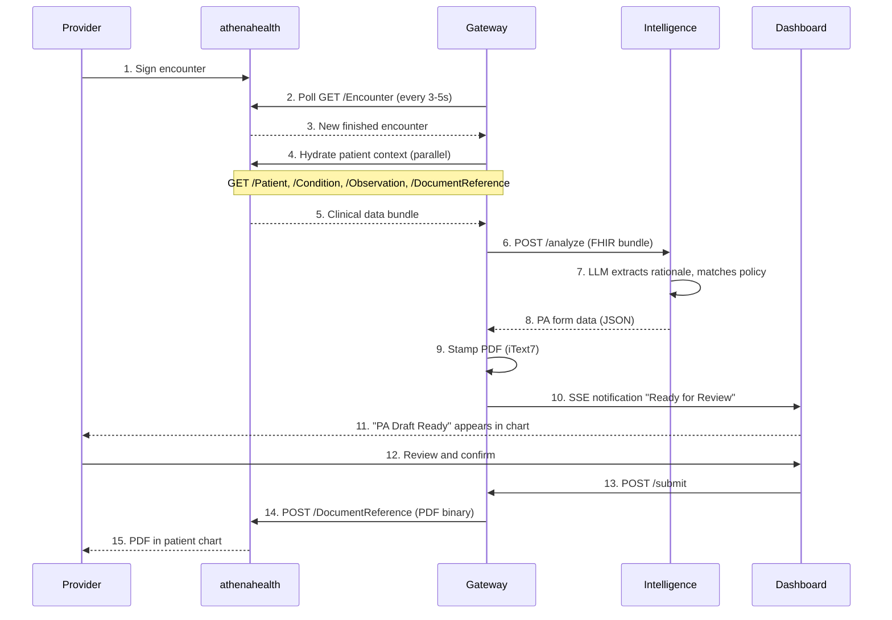

# Design: athenahealth Pivot MVP

## Problem Statement

AuthScript must demonstrate end-to-end prior authorization automation within 6 weeks for a class project demo. Epic's App Orchard process requires 6+ months, making it incompatible with this timeline. The solution must integrate directly into an EHR workflow to prove the "invisible" value proposition.

**Key Constraints:**
- 6-week timeline (class project deadline)
- Pilot practice in discussion (not confirmed)
- Certified API tier only (no premium subscriptions)
- HIPAA-compliant "pass-through" architecture (no PHI storage)

## Chosen Approach

Full integration with athenahealth via Private App model, building on the existing EHR-agnostic architecture. The system will poll for completed encounters, aggregate clinical data, generate PA forms via LLM reasoning, and write completed PDFs back to the patient chart.

**Rationale:**
- athenahealth Private App bypasses Marketplace review (2 weeks vs. 6 months)
- Independent family practices = decision-maker is user (physician owns the PA problem)
- Existing codebase is 95% reusable (Intelligence service and Dashboard are EHR-agnostic)
- Strategy pattern in Gateway enables multi-EHR support

## Technical Design

### System Architecture

```
┌──────────────────────────────────────────────────────────────────────────────┐
│                              athenahealth EHR                                │
├──────────────────────────────────────────────────────────────────────────────┤
│                                                                              │
│  ┌─────────────────┐           ┌─────────────────┐      ┌──────────────────┐ │
│  │   Encounter     │  poll/3s  │    Gateway      │      │  Intelligence    │ │
│  │   Detection     │◄─────────►│   (.NET 10)     │◄────►│  (Python/FastAPI)│ │
│  │   (Finished)    │           │                 │      │                  │ │
│  └─────────────────┘           │  ┌───────────┐  │      │  ┌────────────┐  │ │
│                                │  │ Athena    │  │      │  │ LLM        │  │ │
│  ┌─────────────────┐           │  │ Token     │  │      │  │ Reasoning  │  │ │
│  │   FHIR R4       │◄─────────►│  │ Strategy  │  │      │  │ (GPT-4.1)  │  │ │
│  │   Certified     │  hydrate  │  └───────────┘  │      │  └────────────┘  │ │
│  │   APIs          │           │                 │      │                  │ │
│  └─────────────────┘           │  ┌───────────┐  │      │  ┌────────────┐  │ │
│                                │  │ PDF       │  │      │  │ Policy     │  │ │
│  ┌─────────────────┐           │  │ Generator │  │      │  │ Matcher    │  │ │
│  │   SMART on FHIR │           │  │ (iText7)  │  │      │  └────────────┘  │ │
│  │   Embedded App  │◄──SSE─────│  └───────────┘  │      │                  │ │
│  │   (Dashboard)   │           └─────────────────┘      └──────────────────┘ │
│  └─────────────────┘                                                         │
│                                                                              │
└──────────────────────────────────────────────────────────────────────────────┘
```

### Component Modifications

#### 1. Gateway - Athena Token Strategy

Add `AthenaTokenStrategy` implementing `ITokenAcquisitionStrategy`:

```csharp
public sealed class AthenaTokenStrategy : ITokenAcquisitionStrategy
{
    public bool CanHandle => _options.Provider == "athena";

    public async Task<string?> AcquireTokenAsync(CancellationToken ct)
    {
        // OAuth 2.0 client credentials flow
        // POST to https://api.platform.athenahealth.com/oauth2/token
        // Cache token for duration - 60 seconds
    }
}
```

#### 2. Gateway - Encounter Polling Service

New `IHostedService` for encounter detection:

```csharp
public sealed class AthenaPollingService : BackgroundService
{
    protected override async Task ExecuteAsync(CancellationToken stoppingToken)
    {
        while (!stoppingToken.IsCancellationRequested)
        {
            var newEncounters = await _fhirClient.SearchAsync<Encounter>(
                $"status=finished&date=gt{_lastCheck:O}");

            foreach (var encounter in newEncounters)
            {
                await _processingQueue.EnqueueAsync(encounter.Id);
            }

            _lastCheck = DateTimeOffset.UtcNow;
            await Task.Delay(_pollingInterval, stoppingToken);
        }
    }
}
```

#### 3. Gateway - SSE Notification Hub

Server-Sent Events for real-time dashboard updates:

```csharp
app.MapGet("/api/events", async (HttpContext ctx, CancellationToken ct) =>
{
    ctx.Response.Headers.ContentType = "text/event-stream";
    ctx.Response.Headers.CacheControl = "no-cache";

    await foreach (var notification in _channel.ReadAllAsync(ct))
    {
        await ctx.Response.WriteAsync($"data: {JsonSerializer.Serialize(notification)}\n\n");
        await ctx.Response.Body.FlushAsync(ct);
    }
});
```

#### 4. Dashboard - SMART on FHIR Embed Configuration

Update SMART launch for athenahealth ISS:

```typescript
// Environment-based ISS configuration
const ATHENA_ISS = {
  preview: 'https://api.preview.platform.athenahealth.com/fhir/r4',
  production: 'https://api.platform.athenahealth.com/fhir/r4'
};

// Launch parameters from athenahealth embed
const launchParams = new URLSearchParams(window.location.search);
const patientId = launchParams.get('patient');
const encounterId = launchParams.get('encounter');
```

### Data Flow



### Certified API Mapping

| Endpoint | Use | Scope Required |
|----------|-----|----------------|
| `GET /Encounter` | Polling trigger | `system/Encounter.read` |
| `GET /Patient/{id}` | Demographics | `system/Patient.read` |
| `GET /Condition` | Problem list | `system/Condition.read` |
| `GET /Observation` | Labs, vitals | `system/Observation.read` |
| `GET /DocumentReference` | Clinical notes | `system/DocumentReference.read` |
| `POST /DocumentReference` | PDF write-back | `system/DocumentReference.write` |

### Validated API Constraints

Per [athenahealth documentation](https://docs.athenahealth.com/api/guides/best-practices):

| Constraint | Value | Source |
|------------|-------|--------|
| **DocumentReference POST** | ✅ Supported | USCDI v1+ mandates Clinical Notes write |
| **Document encoding** | Base64 required | Best Practices guide |
| **Max attachment size** | 20 MB | Best Practices guide |
| **Preview rate limit** | 15 req/sec, 50K/day | Best Practices guide |
| **Production rate limit** | 150 req/sec | Best Practices guide |
| **Access authorization** | Practice-level consent | Onboarding Overview |

### Rate Limiting Strategy

```
Certified API Limits:
- Preview: 15 req/sec, 50,000 calls/day
- Production: 150 req/sec

Our Usage per Polling Cycle (5s):
- 1 poll request
- N hydration requests (burst, N = ~5 resources per patient)

Safety Margin:
- Poll interval: 5 seconds in preview, can reduce to 3s in production
- Batch hydration with concurrent limit of 5
- Exponential backoff on 429 responses
- Daily budget: 50K calls = ~17K polling cycles = ample headroom
```

## Integration Points

### Existing Code Reuse

| Component | Status | Changes Needed |
|-----------|--------|----------------|
| `ITokenAcquisitionStrategy` | In progress (Epic plan) | Add athena implementation |
| `IFhirClient` | Exists, abstracted | None |
| Intelligence service | Exists, EHR-agnostic | None |
| Dashboard | Exists, SMART-ready | ISS configuration |
| PDF generation (iText7) | Exists | None |

### New Components

| Component | Effort | Priority |
|-----------|--------|----------|
| `AthenaTokenStrategy` | 4 hours | P0 |
| `AthenaPollingService` | 8 hours | P0 |
| SSE notification hub | 4 hours | P1 |
| Dashboard SSE client | 4 hours | P1 |
| DocumentReference write endpoint | 4 hours | P1 |

### Configuration

```json
{
  "Athena": {
    "ClientId": "${ATHENA_CLIENT_ID}",
    "ClientSecret": "${ATHENA_CLIENT_SECRET}",
    "FhirBaseUrl": "https://api.platform.athenahealth.com/fhir/r4",
    "TokenEndpoint": "https://api.platform.athenahealth.com/oauth2/token",
    "PollingIntervalSeconds": 5,
    "PracticeId": "${ATHENA_PRACTICE_ID}"
  }
}
```

## Testing Strategy

### Unit Tests

| Component | Test Focus |
|-----------|------------|
| `AthenaTokenStrategy` | OAuth flow, token caching, refresh |
| `AthenaPollingService` | Interval timing, deduplication |
| SSE hub | Client connection, message serialization |

### Integration Tests (Sandbox)

| Scenario | Steps |
|----------|-------|
| Token acquisition | Request token, verify expiry handling |
| Encounter polling | Create encounter in sandbox, verify detection |
| Full pipeline | Sign encounter → verify PDF in chart |

### E2E Demo Test

Scripted walkthrough with sandbox data:
1. Pre-create patient with conditions/observations
2. Create and sign encounter
3. Watch polling detect encounter
4. Verify LLM generates accurate PA form
5. Confirm PDF appears in DocumentReference

## Risk Mitigation

| Risk | Status | Mitigation |
|------|--------|------------|
| DocumentReference.write access | ✅ Resolved | Confirmed in Certified tier (USCDI mandate) |
| Pilot access falls through | ⚠️ Active | Sandbox demo viable; seek alternative practice |
| LLM accuracy insufficient | ⚠️ Active | Hardcode demo payer policy; curate test cases |
| Polling rate limited | ✅ Resolved | 15 QPS preview / 150 QPS prod is ample |
| 6-week timeline too tight | ⚠️ Active | Lean MVP fallback (drop embedded app) |

## Open Questions

1. **Practice Configuration:** How will we onboard additional practices post-demo? (Multi-tenant architecture is designed but not implemented)

2. **Payer Policy Source:** Where do payer-specific PA requirements come from? (Current: hardcoded demo policy)

3. **HIPAA BAA:** Is BAA required for Private App pilot? (Likely yes for production PHI)

## Implementation Phases

### Phase 1: Foundation (Week 1-2)
- Complete Epic FHIR refactor (strategy pattern)
- Implement `AthenaTokenStrategy`
- Verify sandbox access and credentials

### Phase 2: Core Pipeline (Week 3-4)
- Implement `AthenaPollingService`
- Integrate polling with existing hydration logic
- Verify Intelligence service works with athena data

### Phase 3: User Experience (Week 5)
- Implement SSE notification hub
- Connect Dashboard to SSE
- Implement DocumentReference write-back

### Phase 4: Demo Prep (Week 6)
- Create demo script and test data
- Run E2E tests in sandbox
- Prepare fallback if pilot unavailable

## Success Criteria

- [ ] Polling detects finished encounters within 10 seconds
- [ ] LLM generates PA form with >80% field accuracy on demo cases
- [ ] PDF appears in patient chart after provider confirmation
- [ ] Full workflow completes in under 3 minutes
- [ ] Demo runs without manual intervention

## References

- [athenahealth Certified APIs](https://docs.athenahealth.com/api/guides/certified-apis)
- [athenahealth Embedded Apps](https://docs.athenahealth.com/api/guides/embedded-apps)
- [athenahealth FHIR R4 Base URLs](https://docs.athenahealth.com/api/guides/base-fhir-urls)
- [athenahealth Best Practices](https://docs.athenahealth.com/api/guides/best-practices)
- [athenahealth Onboarding Overview](https://docs.athenahealth.com/api/guides/onboarding-overview)
- [Pivot Memo](../pitch/pivot-memo.md)
- [Architecture Proposal](../pitch/authscript-pivot-architecture-proposal.md)
- [Viability Addendum](../pitch/viability-addendum.md)
- [Epic FHIR Integration Design](2026-01-28-epic-fhir-integration.md)
