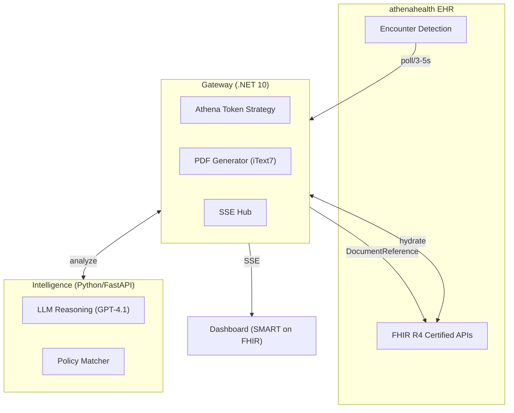
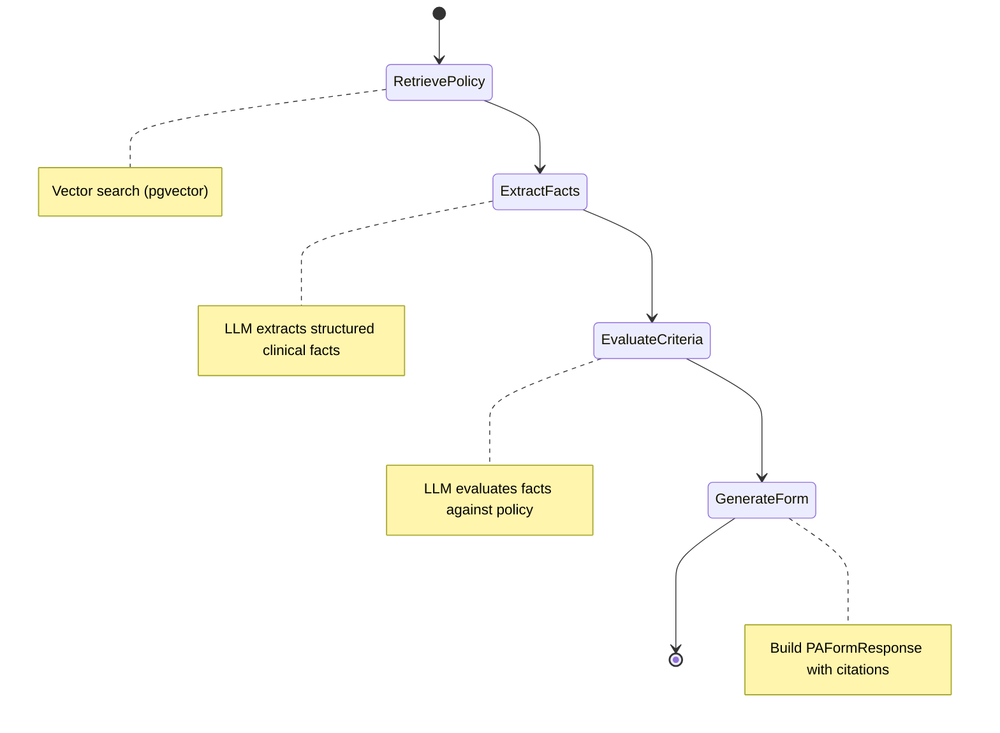
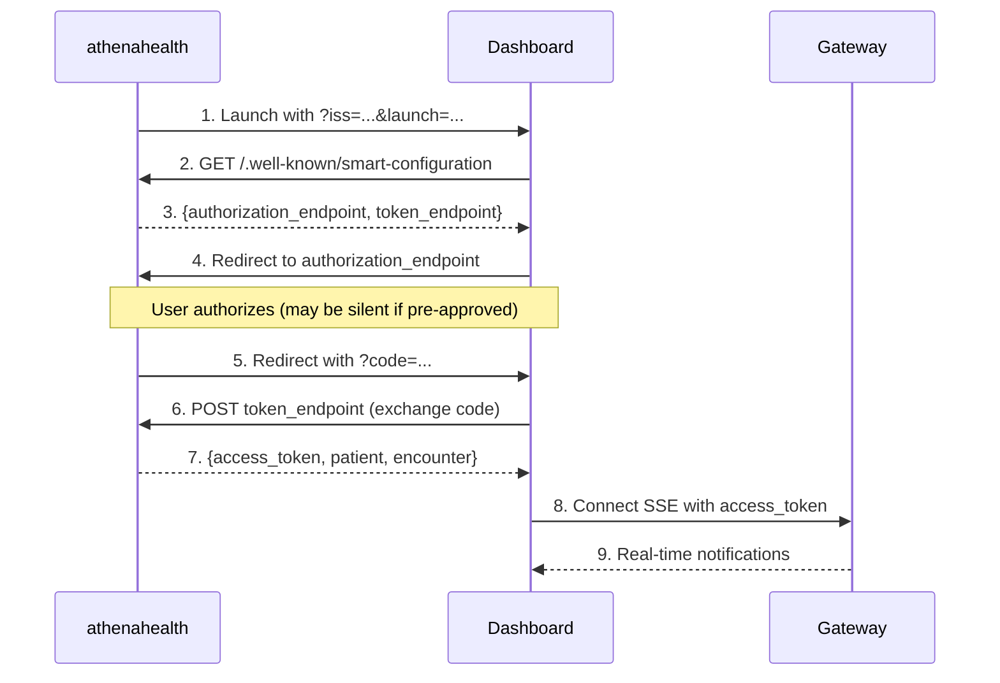
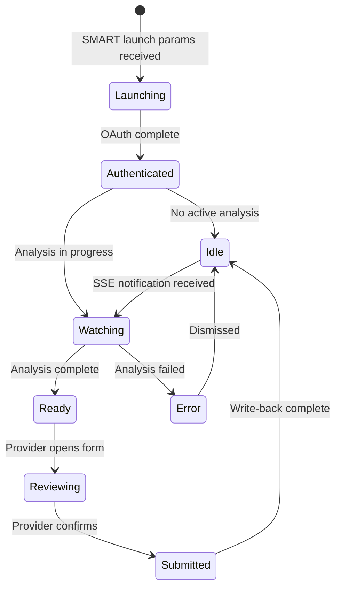
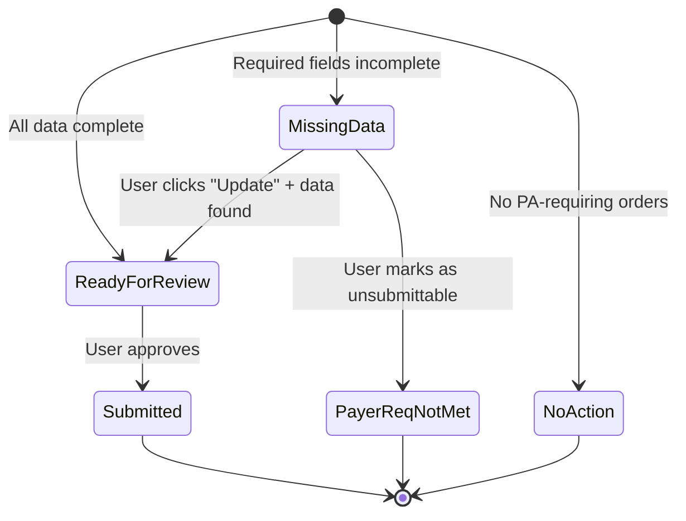
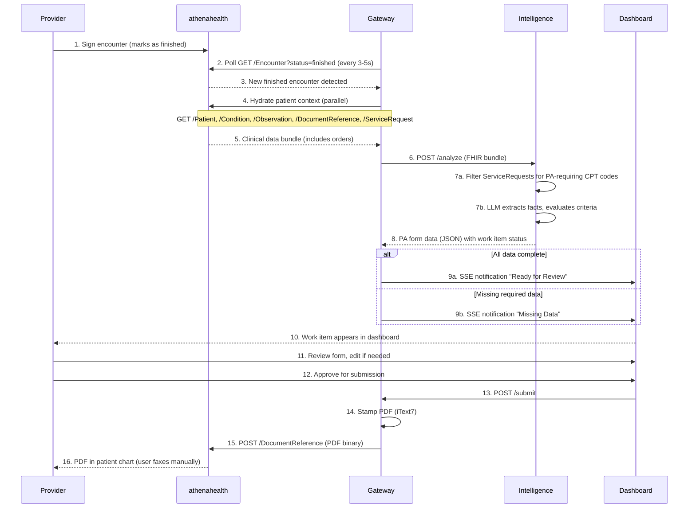
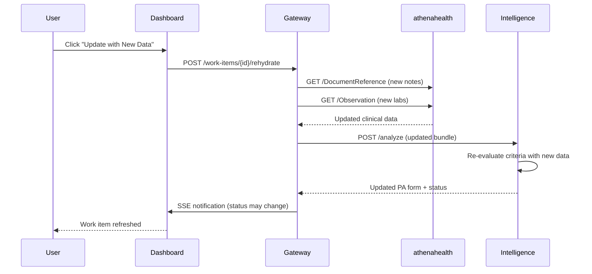

# Design: athenahealth Pivot MVP

## Problem Statement

AuthScript must demonstrate end-to-end prior authorization automation within 6 weeks for a class project demo. Epic's App Orchard process requires 6+ months, making it incompatible with this timeline. The solution must integrate directly into an EHR workflow to prove the "invisible" value proposition.

**Key Constraints:**
- 6-week timeline (class project deadline)
- Pilot practice in discussion (not confirmed)
- Certified API tier only (no premium subscriptions)
- HIPAA-compliant "pass-through" architecture (no PHI storage)

## Chosen Approach

Full integration with athenahealth via Private App model, building on the existing EHR-agnostic architecture. The system will poll for completed encounters, aggregate clinical data, generate PA forms via LLM reasoning, and write completed PDFs back to the patient chart.

**Rationale:**
- athenahealth Private App bypasses Marketplace review (2 weeks vs. 6 months)
- Independent family practices = decision-maker is user (physician owns the PA problem)
- Existing codebase is 95% reusable (Intelligence service and Dashboard are EHR-agnostic)
- Strategy pattern in Gateway enables multi-EHR support

## Technical Design

### System Architecture

```
┌──────────────────────────────────────────────────────────────────────────────┐
│                              athenahealth EHR                                │
├──────────────────────────────────────────────────────────────────────────────┤
│                                                                              │
│  ┌─────────────────┐           ┌─────────────────┐      ┌──────────────────┐ │
│  │   Encounter     │  poll/3s  │    Gateway      │      │  Intelligence    │ │
│  │   Detection     │◄─────────►│   (.NET 10)     │◄────►│  (Python/FastAPI)│ │
│  │   (Finished)    │           │                 │      │                  │ │
│  └─────────────────┘           │  ┌───────────┐  │      │  ┌────────────┐  │ │
│                                │  │ Athena    │  │      │  │ LLM        │  │ │
│  ┌─────────────────┐           │  │ Token     │  │      │  │ Reasoning  │  │ │
│  │   FHIR R4       │◄─────────►│  │ Strategy  │  │      │  │ (GPT-4.1)  │  │ │
│  │   Certified     │  hydrate  │  └───────────┘  │      │  └────────────┘  │ │
│  │   APIs          │           │                 │      │                  │ │
│  └─────────────────┘           │  ┌───────────┐  │      │  ┌────────────┐  │ │
│                                │  │ PDF       │  │      │  │ Policy     │  │ │
│  ┌─────────────────┐           │  │ Generator │  │      │  │ Matcher    │  │ │
│  │   SMART on FHIR │           │  │ (iText7)  │  │      │  └────────────┘  │ │
│  │   Embedded App  │◄──SSE─────│  └───────────┘  │      │                  │ │
│  │   (Dashboard)   │           └─────────────────┘      └──────────────────┘ │
│  └─────────────────┘                                                         │
│                                                                              │
└──────────────────────────────────────────────────────────────────────────────┘
```



### Component Modifications

#### 1. Gateway - Athena Token Strategy

Add `AthenaTokenStrategy` implementing `ITokenAcquisitionStrategy`:

```csharp
public sealed class AthenaTokenStrategy : ITokenAcquisitionStrategy
{
    public bool CanHandle => _options.Provider == "athena";

    public async Task<string?> AcquireTokenAsync(CancellationToken ct)
    {
        // OAuth 2.0 client credentials flow
        // POST to https://api.platform.athenahealth.com/oauth2/token
        // Cache token for duration - 60 seconds
    }
}
```

#### 2. Gateway - Encounter Polling Service

New `IHostedService` for encounter detection. The service polls for finished encounters; ServiceRequest resources are fetched during hydration to identify orders requiring PA.

**Trigger Flow:**
```
Poll Encounter?status=finished
  └─► Queue encounter ID
      └─► EncounterProcessor hydrates clinical bundle (including ServiceRequest)
          └─► Intelligence service filters for PA-requiring CPT codes
              └─► Create work item per qualifying order
```

```csharp
public sealed class AthenaPollingService : BackgroundService
{
    protected override async Task ExecuteAsync(CancellationToken stoppingToken)
    {
        while (!stoppingToken.IsCancellationRequested)
        {
            var newEncounters = await _fhirClient.SearchAsync<Encounter>(
                $"status=finished&date=gt{_lastCheck:O}");

            foreach (var encounter in newEncounters)
            {
                // Queue for processing; hydration fetches ServiceRequest
                await _processingQueue.EnqueueAsync(encounter.Id);
            }

            _lastCheck = DateTimeOffset.UtcNow;
            await Task.Delay(_pollingInterval, stoppingToken);
        }
    }
}
```

**Why Encounter-First (not Order-First):**
- Clinical documentation is complete when encounter is finished
- Provider has finalized treatment decisions
- LLM has maximum context for PA form generation
- Simpler deduplication (by encounter ID)

#### 3. Gateway - SSE Notification Hub

Server-Sent Events for real-time dashboard updates:

```csharp
app.MapGet("/api/events", async (HttpContext ctx, CancellationToken ct) =>
{
    ctx.Response.Headers.ContentType = "text/event-stream";
    ctx.Response.Headers.CacheControl = "no-cache";

    await foreach (var notification in _channel.ReadAllAsync(ct))
    {
        await ctx.Response.WriteAsync($"data: {JsonSerializer.Serialize(notification)}\n\n");
        await ctx.Response.Body.FlushAsync(ct);
    }
});
```

#### 4. Dashboard - SMART on FHIR Embed Configuration

Update SMART launch for athenahealth ISS:

```typescript
// Environment-based ISS configuration
const ATHENA_ISS = {
  preview: 'https://api.preview.platform.athenahealth.com/fhir/r4',
  production: 'https://api.platform.athenahealth.com/fhir/r4'
};

// Launch parameters from athenahealth embed
const launchParams = new URLSearchParams(window.location.search);
const patientId = launchParams.get('patient');
const encounterId = launchParams.get('encounter');
```

### Intelligence Service Architecture

The Intelligence service uses a **hybrid Extract-then-Reason pipeline** orchestrated by [LangGraph](https://langchain-ai.github.io/langgraph/) for reliable, auditable clinical reasoning.

#### LangGraph Pipeline



```python
from langgraph.graph import StateGraph, END

class AnalysisState(TypedDict):
    clinical_bundle: ClinicalBundle
    procedure_code: str
    payer_id: str | None
    policy: PolicyDocument | None
    extracted_facts: ExtractedFacts | None
    criteria_results: list[CriteriaResult]
    form_response: PAFormResponse | None
    error: str | None

def build_analysis_graph() -> StateGraph:
    graph = StateGraph(AnalysisState)

    graph.add_node("retrieve_policy", retrieve_policy_node)
    graph.add_node("extract_facts", extract_facts_node)
    graph.add_node("evaluate_criteria", evaluate_criteria_node)
    graph.add_node("generate_form", generate_form_node)

    graph.set_entry_point("retrieve_policy")
    graph.add_edge("retrieve_policy", "extract_facts")
    graph.add_edge("extract_facts", "evaluate_criteria")
    graph.add_edge("evaluate_criteria", "generate_form")
    graph.add_edge("generate_form", END)

    return graph.compile()
```

#### Stage 0: Policy Retrieval (Vector Search)

Policies are stored as JSON documents in PostgreSQL with pgvector embeddings for semantic search.

**Policy Schema:**

```python
@dataclass
class PolicyDocument:
    policy_id: str
    payer_name: str
    procedure_codes: list[str]  # CPT codes this policy covers
    effective_date: date
    criteria: list[PolicyCriterion]
    form_field_mappings: dict[str, str]

@dataclass
class PolicyCriterion:
    criterion_id: str
    description: str  # Human-readable requirement
    evidence_prompt: str  # Prompt fragment for LLM extraction
    required: bool
    bypasses: list[str]  # Other criteria this bypasses if met (e.g., red flags)
```

**Retrieval Logic:**

```python
async def retrieve_policy_node(state: AnalysisState) -> AnalysisState:
    # Embed the procedure code + payer context
    query = f"Prior authorization policy for {state.procedure_code}"
    if state.payer_id:
        query += f" with {state.payer_id}"

    # Vector similarity search
    policy = await policy_store.search(
        query_embedding=embed(query),
        filter={"procedure_codes": {"$contains": state.procedure_code}},
        limit=1
    )

    return {**state, "policy": policy}
```

**Storage:** PostgreSQL with pgvector extension (already in Aspire stack).

#### Stage 1: Clinical Fact Extraction (LLM)

Extract structured facts from unstructured clinical notes and FHIR resources.

**Extracted Facts Schema:**

```python
@dataclass
class ExtractedFacts:
    diagnoses: list[DiagnosisFact]
    treatments: list[TreatmentFact]
    medications: list[MedicationFact]
    lab_results: list[LabFact]
    clinical_timeline: list[TimelineEvent]

@dataclass
class DiagnosisFact:
    code: str  # ICD-10
    display: str
    source: str  # "FHIR Condition/123" or "Note dated 2026-01-15"
    confidence: float

@dataclass
class TreatmentFact:
    treatment_type: str  # "physical_therapy", "medication", "injection", etc.
    start_date: date | None
    end_date: date | None
    duration_weeks: int | None
    outcome: str | None  # "failed", "partial_response", "ongoing"
    source: str
```

**Extraction Prompt Pattern:**

```python
EXTRACTION_PROMPT = """
You are a clinical data extractor. Given the patient's clinical data, extract structured facts.

## Clinical Data
{clinical_bundle_json}

## Required Extractions
For each finding, include the source (FHIR resource ID or note date).

1. **Diagnoses**: ICD-10 codes with descriptions
2. **Treatments**: Type, dates, duration, and outcome
3. **Medications**: Name, dosage, start/end dates
4. **Labs**: Relevant results with dates
5. **Timeline**: Key clinical events in chronological order

Return as JSON matching the ExtractedFacts schema.
"""
```

#### Stage 2: Criteria Evaluation (LLM)

Evaluate extracted facts against policy criteria to determine which requirements are met.

**Criteria Result Schema:**

```python
@dataclass
class CriteriaResult:
    criterion_id: str
    status: Literal["MET", "NOT_MET", "UNCLEAR"]
    evidence: list[EvidenceItem]
    reasoning: str  # LLM explanation of why criterion is/isn't met

@dataclass
class EvidenceItem:
    fact_reference: str  # Points to ExtractedFact
    source_citation: str  # "Progress note 01/15/2026" or "Condition/abc123"
    relevance: str  # How this fact supports the criterion
```

**Evaluation Prompt Pattern:**

```python
EVALUATION_PROMPT = """
You are a prior authorization specialist. Evaluate whether the clinical evidence meets each policy criterion.

## Policy: {policy.payer_name} - {policy.policy_id}

## Criteria to Evaluate
{criteria_list}

## Extracted Clinical Facts
{extracted_facts_json}

For each criterion:
1. Determine if MET, NOT_MET, or UNCLEAR
2. Cite specific evidence from the facts (include source)
3. Explain your reasoning

Return as JSON matching the list[CriteriaResult] schema.
"""
```

#### Stage 3: Form Generation

Build the final PA form response with field mappings and clinical summary.

```python
async def generate_form_node(state: AnalysisState) -> AnalysisState:
    # Determine recommendation based on criteria results
    required_criteria = [c for c in state.policy.criteria if c.required]
    met_required = [r for r in state.criteria_results
                    if r.status == "MET" and r.criterion_id in required_criteria]

    if len(met_required) == len(required_criteria):
        recommendation = "APPROVE"
    elif any(r.status == "UNCLEAR" for r in state.criteria_results):
        recommendation = "NEED_INFO"
    else:
        recommendation = "MANUAL_REVIEW"

    # Generate clinical summary via LLM
    summary = await generate_clinical_summary(
        state.extracted_facts,
        state.criteria_results
    )

    # Map to form fields
    form_fields = map_to_form_fields(
        state.clinical_bundle,
        state.extracted_facts,
        state.policy.form_field_mappings
    )

    return {
        **state,
        "form_response": PAFormResponse(
            recommendation=recommendation,
            confidence=calculate_confidence(state.criteria_results),
            clinical_summary=summary,
            evidence=flatten_evidence(state.criteria_results),
            form_fields=form_fields
        )
    }
```

#### Intelligence Service API

**POST /analyze** - Synchronous analysis (existing endpoint, updated implementation)

**POST /analyze/stream** - SSE streaming for real-time progress

```python
@app.post("/analyze/stream")
async def analyze_stream(request: AnalyzeRequest):
    async def event_generator():
        graph = build_analysis_graph()

        async for event in graph.astream(initial_state):
            yield {
                "event": "progress",
                "data": json.dumps({
                    "stage": event.node,
                    "status": "running" if not event.done else "complete",
                    "partial_result": serialize_partial(event.state)
                })
            }

        yield {"event": "complete", "data": json.dumps(event.state["form_response"])}

    return EventSourceResponse(event_generator())
```

### Dashboard Architecture

> **Note:** Dashboard UI specifics are **pending wireframes and customer environment access**. This section outlines the technical architecture and basic functionality.

#### SMART on FHIR OAuth Flow (athenahealth)

Complete OAuth 2.0 authorization flow for embedded app launch:



**Implementation:**

```typescript
// lib/smartAuth.ts
export async function handleSmartLaunch(iss: string, launch: string): Promise<SmartContext> {
  // 1. Discover SMART configuration
  const config = await fetch(`${iss}/.well-known/smart-configuration`).then(r => r.json());

  // 2. Build authorization URL
  const authUrl = new URL(config.authorization_endpoint);
  authUrl.searchParams.set('response_type', 'code');
  authUrl.searchParams.set('client_id', ATHENA_CLIENT_ID);
  authUrl.searchParams.set('redirect_uri', REDIRECT_URI);
  authUrl.searchParams.set('scope', 'launch patient/*.read openid fhirUser');
  authUrl.searchParams.set('state', generateState());
  authUrl.searchParams.set('aud', iss);
  authUrl.searchParams.set('launch', launch);

  // 3. Redirect for authorization
  window.location.href = authUrl.toString();
}

export async function handleCallback(code: string, state: string): Promise<SmartContext> {
  // 4. Exchange code for token
  const tokenResponse = await fetch(tokenEndpoint, {
    method: 'POST',
    body: new URLSearchParams({
      grant_type: 'authorization_code',
      code,
      redirect_uri: REDIRECT_URI,
      client_id: ATHENA_CLIENT_ID,
    }),
  });

  const { access_token, patient, encounter } = await tokenResponse.json();

  return { accessToken: access_token, patientId: patient, encounterId: encounter };
}
```

#### SSE Client for Real-Time Updates

Replace polling with Server-Sent Events for live progress tracking:

```typescript
// hooks/useAnalysisStream.ts
export function useAnalysisStream(transactionId: string | null) {
  const [status, setStatus] = useState<AnalysisStatus>({ stage: 'idle' });
  const [result, setResult] = useState<PAFormResponse | null>(null);

  useEffect(() => {
    if (!transactionId) return;

    const eventSource = new EventSource(
      `${API_BASE}/api/analysis/${transactionId}/stream`,
      { withCredentials: true }
    );

    eventSource.addEventListener('progress', (e) => {
      const data = JSON.parse(e.data);
      setStatus({
        stage: data.stage,
        progress: data.progress,
        message: data.message,
      });
    });

    eventSource.addEventListener('complete', (e) => {
      setResult(JSON.parse(e.data));
      eventSource.close();
    });

    eventSource.addEventListener('error', (e) => {
      setStatus({ stage: 'error', error: 'Connection lost' });
      eventSource.close();
    });

    return () => eventSource.close();
  }, [transactionId]);

  return { status, result };
}
```

#### Core Dashboard Functionality

| Feature | Description | Status |
|---------|-------------|--------|
| **SMART Launch** | OAuth flow with athenahealth ISS | To implement |
| **Patient Context** | Display patient name, DOB, encounter date | To implement |
| **Analysis Progress** | Real-time stage progress via SSE | To implement |
| **Evidence Review** | Display criteria with MET/NOT_MET/UNCLEAR status | Exists (needs data wiring) |
| **Form Preview** | Show pre-filled PA form fields | Exists (needs data wiring) |
| **Confidence Display** | Visual indicator of overall confidence | Exists |
| **Submit Action** | Confirm and trigger DocumentReference write-back | To implement |
| **Notification Badge** | "PA Draft Ready" indicator in embedded view | To implement |

#### Dashboard State Flow



#### Work Item States and User Workflow

**State Machine:**



**Work Item States:**

| State | Description | User Actions |
|-------|-------------|--------------|
| `NO_PA_REQUIRED` | AI determined no orders need PA | None (auto-closed) |
| `READY_FOR_REVIEW` | Form complete, awaiting approval | Review, Edit, Approve |
| `MISSING_DATA` | Required fields incomplete | "Update with New Data", "Payer Requirements Not Met" |
| `PAYER_REQUIREMENTS_NOT_MET` | User marked as unsubmittable | None (terminal) |
| `SUBMITTED` | PDF written to chart | None (user faxes manually) |

**User Workflow Paths (from Product Team):**

**Path A: Data Complete**
1. Work item appears in "Ready for Review" queue
2. User reviews pre-filled form for accuracy
3. User edits fields if needed
4. User clicks "Approve" → PDF written to chart
5. User opens document in athenaNet and faxes to payer

**Path B: Data Incomplete**
1. Work item appears in "Missing Data" queue
2. User reviews what's missing
3. **Option 1:** User clicks "Update with New Data" → system re-fetches from EHR → re-analyzes
4. **Option 2:** User clicks "Payer Requirements Not Met" → work item closed

#### Pending Items (Require Wireframes/Environment)

- [ ] Visual design for embedded app chrome (athenahealth style compliance)
- [ ] Notification badge placement within athenahealth UI
- [ ] Mobile/responsive layout requirements
- [ ] Error state designs (auth failure, analysis failure, network issues)
- [ ] Provider feedback capture UI (for accuracy improvement loop)
- [ ] "Copy Payer Fax Number" action (from reconciliation doc)

### Data Flow



### Missing Data Re-Hydration Flow



### Certified API Mapping

| Endpoint | Use | Scope Required |
|----------|-----|----------------|
| `GET /Encounter` | Polling trigger | `system/Encounter.read` |
| `GET /Patient/{id}` | Demographics | `system/Patient.read` |
| `GET /Condition` | Problem list | `system/Condition.read` |
| `GET /Observation` | Labs, vitals | `system/Observation.read` |
| `GET /DocumentReference` | Clinical notes | `system/DocumentReference.read` |
| `GET /ServiceRequest` | Orders/referrals (Intent to Treat) | `system/ServiceRequest.read` |
| `POST /DocumentReference` | PDF write-back | `system/DocumentReference.write` |

> **Note:** ServiceRequest is confirmed available in athenahealth's FHIR R4 Certified API tier per their [Implementation Guide](https://sb.docs.mydata.athenahealth.com/fhir-r4/index.html).

### Validated API Constraints

Per [athenahealth documentation](https://docs.athenahealth.com/api/guides/best-practices):

| Constraint | Value | Source |
|------------|-------|--------|
| **DocumentReference POST** | ✅ Supported | USCDI v1+ mandates Clinical Notes write |
| **Document encoding** | Base64 required | Best Practices guide |
| **Max attachment size** | 20 MB | Best Practices guide |
| **Preview rate limit** | 15 req/sec, 50K/day | Best Practices guide |
| **Production rate limit** | 150 req/sec | Best Practices guide |
| **Access authorization** | Practice-level consent | Onboarding Overview |

### Rate Limiting Strategy

```
Certified API Limits:
- Preview: 15 req/sec, 50,000 calls/day
- Production: 150 req/sec

Our Usage per Polling Cycle (5s):
- 1 poll request
- N hydration requests (burst, N = ~5 resources per patient)

Safety Margin:
- Poll interval: 5 seconds in preview, can reduce to 3s in production
- Batch hydration with concurrent limit of 5
- Exponential backoff on 429 responses
- Daily budget: 50K calls = ~17K polling cycles = ample headroom
```

## Integration Points

### Existing Code Reuse

| Component | Status | Changes Needed |
|-----------|--------|----------------|
| `ITokenAcquisitionStrategy` | In progress (Epic plan) | Add athena implementation |
| `IFhirClient` | Exists, abstracted | Add `SearchServiceRequestsAsync()` method |
| `ClinicalBundle` | Exists | Add `ServiceRequests` property |
| `FhirDataAggregator` | Exists | Add ServiceRequest fetch to parallel hydration |
| Intelligence service | Exists (stubbed) | Implement LangGraph pipeline |
| Dashboard | Exists (stubbed) | Implement SMART OAuth, SSE client |
| PDF generation (iText7) | Exists | None |
| PostgreSQL (Aspire) | Exists | Add pgvector extension, policy tables |

### Required Model Changes

**`ClinicalBundle`** — Add ServiceRequest collection:
```csharp
/// <summary>
/// Gets the list of orders/referrals (ServiceRequest resources).
/// Used to identify treatments requiring prior authorization.
/// </summary>
public List<ServiceRequestInfo> ServiceRequests { get; init; } = [];
```

**`ServiceRequestInfo`** — New model (to be created):
```csharp
public sealed record ServiceRequestInfo
{
    public required string Id { get; init; }
    public required string Status { get; init; }  // active, completed, cancelled
    public required CodeableConcept Code { get; init; }  // CPT code
    public string? EncounterId { get; init; }
    public DateTimeOffset? AuthoredOn { get; init; }
}
```

**`IFhirClient`** — Add method:
```csharp
Task<List<ServiceRequestInfo>> SearchServiceRequestsAsync(
    string patientId,
    string? encounterId,
    string accessToken,
    CancellationToken ct = default);
```

### New Components

| Component | Service | Priority |
|-----------|---------|----------|
| **Gateway** | | |
| `AthenaTokenStrategy` | Gateway | P0 |
| `AthenaPollingService` | Gateway | P0 |
| SSE notification hub | Gateway | P1 |
| DocumentReference write endpoint | Gateway | P1 |
| Work item state management | Gateway | P1 |
| Re-hydration endpoint (`POST /work-items/{id}/rehydrate`) | Gateway | P1 |
| **Intelligence** | | |
| LangGraph analysis pipeline | Intelligence | P0 |
| Policy vector store (pgvector) | Intelligence | P0 |
| Clinical fact extraction stage | Intelligence | P0 |
| Criteria evaluation stage | Intelligence | P0 |
| ServiceRequest CPT filtering | Intelligence | P0 |
| Streaming analysis endpoint | Intelligence | P1 |
| **Dashboard** | | |
| SMART OAuth flow (athenahealth) | Dashboard | P0 |
| SSE client hook | Dashboard | P1 |
| Evidence/form data wiring | Dashboard | P1 |
| Submit action endpoint | Dashboard | P1 |
| "Update with New Data" action | Dashboard | P1 |
| "Payer Requirements Not Met" action | Dashboard | P1 |
| Copy payer fax number action | Dashboard | P2 |

### Configuration

```json
{
  "Athena": {
    "ClientId": "${ATHENA_CLIENT_ID}",
    "ClientSecret": "${ATHENA_CLIENT_SECRET}",
    "FhirBaseUrl": "https://api.platform.athenahealth.com/fhir/r4",
    "TokenEndpoint": "https://api.platform.athenahealth.com/oauth2/token",
    "PollingIntervalSeconds": 5,
    "PracticeId": "${ATHENA_PRACTICE_ID}"
  }
}
```

## Testing Strategy

### Unit Tests

| Component | Test Focus |
|-----------|------------|
| **Gateway** | |
| `AthenaTokenStrategy` | OAuth flow, token caching, refresh |
| `AthenaPollingService` | Interval timing, deduplication |
| SSE hub | Client connection, message serialization |
| Work item state transitions | Valid transitions, invalid transition rejection |
| Re-hydration endpoint | Fetches new data, triggers re-analysis |
| **Intelligence** | |
| ServiceRequest CPT filtering | Identifies PA-requiring codes, ignores others |
| Policy retrieval | Vector search accuracy, filtering by procedure code |
| Fact extraction | Schema compliance, source citation accuracy |
| Criteria evaluation | MET/NOT_MET/UNCLEAR logic, evidence linking |
| Form generation | Field mapping, recommendation logic |
| **Dashboard** | |
| SMART OAuth | State management, token storage, redirect handling |
| SSE hook | Connection lifecycle, event parsing, reconnection |
| Work item actions | Update, Payer Req Not Met, Submit |

### Integration Tests (Sandbox)

| Scenario | Steps |
|----------|-------|
| Token acquisition | Request token, verify expiry handling |
| Encounter polling | Create encounter in sandbox, verify detection |
| Full pipeline | Sign encounter → verify PDF in chart |

### E2E Demo Test

Scripted walkthrough with sandbox data:
1. Pre-create patient with conditions/observations
2. Create and sign encounter
3. Watch polling detect encounter
4. Verify LLM generates accurate PA form
5. Confirm PDF appears in DocumentReference

## Risk Mitigation

| Risk | Status | Mitigation |
|------|--------|------------|
| DocumentReference.write access | ✅ Resolved | Confirmed in Certified tier (USCDI mandate) |
| Pilot access falls through | ⚠️ Active | Sandbox demo viable; seek alternative practice |
| LLM accuracy insufficient | ⚠️ Active | Two-stage pipeline with fact extraction improves auditability; curate test cases |
| Polling rate limited | ✅ Resolved | 15 QPS preview / 150 QPS prod is ample |
| 6-week timeline too tight | ⚠️ Active | Lean MVP fallback (drop embedded app, use standalone) |
| LangGraph complexity | ⚠️ Active | Pipeline stages are independently testable; can fall back to sequential calls |
| Policy coverage gaps | ⚠️ Active | Start with 2-3 well-defined demo policies; vector search handles variations |

## Open Questions

1. **Practice Configuration:** How will we onboard additional practices post-demo? (Multi-tenant architecture is designed but not implemented)

2. ~~**Payer Policy Source:**~~ ✅ **Resolved** — Policies stored as JSON documents in PostgreSQL with pgvector embeddings, retrieved via semantic search based on procedure/payer context.

3. **HIPAA BAA:** Is BAA required for Private App pilot? (Likely yes for production PHI)

4. **Dashboard Wireframes:** UI design pending customer environment access and visual requirements from athenahealth style guide.

5. **Demo Policy Content:** Which specific payer policies will we seed for the demo? (Suggest: Blue Cross MRI Lumbar, UnitedHealthcare PT evaluation)

## Implementation Phases

### Phase 1: Foundation (Week 1-2)
- Complete FHIR refactor (strategy pattern)
- Implement `AthenaTokenStrategy`
- Verify sandbox access and credentials
- Set up pgvector extension and policy tables
- Seed 2-3 demo policies (MRI Lumbar, PT evaluation)

### Phase 2: Intelligence Pipeline (Week 3-4)
- Implement LangGraph analysis pipeline
- Build fact extraction stage with LLM
- Build criteria evaluation stage with LLM
- Implement policy vector retrieval
- Unit test each pipeline stage

### Phase 3: Gateway Integration (Week 4-5)
- Implement `AthenaPollingService`
- Integrate polling → hydration → Intelligence pipeline
- Implement SSE notification hub
- Implement DocumentReference write-back

### Phase 4: Dashboard & Demo (Week 5-6)
- Complete SMART OAuth flow (athenahealth)
- Implement SSE client for real-time progress
- Wire evidence/form components to live data
- Create demo script and test data
- Run E2E tests in sandbox
- Prepare fallback if pilot unavailable

## Success Criteria

- [ ] Polling detects finished encounters within 10 seconds
- [ ] LLM generates PA form with >80% field accuracy on demo cases
- [ ] PDF appears in patient chart after provider confirmation
- [ ] Full workflow completes in under 3 minutes
- [ ] Demo runs without manual intervention

## Dependencies

### Intelligence Service (Python)

| Package | Purpose |
|---------|---------|
| `langgraph` | LLM workflow orchestration |
| `langchain-openai` | OpenAI/Azure OpenAI LLM provider |
| `pgvector` | Vector similarity search for policies |
| `asyncpg` | Async PostgreSQL driver |
| `sse-starlette` | Server-Sent Events for FastAPI |

### Dashboard (TypeScript)

| Package | Purpose |
|---------|---------|
| `fhirclient` | SMART on FHIR OAuth library (optional) |
| Native `EventSource` | SSE client (built-in) |

### Infrastructure

| Component | Purpose |
|-----------|---------|
| PostgreSQL + pgvector | Policy storage with vector search |
| Redis | Encounter deduplication, draft caching |

## References

### athenahealth
- [Certified APIs](https://docs.athenahealth.com/api/guides/certified-apis)
- [Embedded Apps](https://docs.athenahealth.com/api/guides/embedded-apps)
- [FHIR R4 Base URLs](https://docs.athenahealth.com/api/guides/base-fhir-urls)
- [Best Practices](https://docs.athenahealth.com/api/guides/best-practices)
- [Onboarding Overview](https://docs.athenahealth.com/api/guides/onboarding-overview)

### Technical
- [LangGraph Documentation](https://langchain-ai.github.io/langgraph/)
- [pgvector GitHub](https://github.com/pgvector/pgvector)
- [SMART on FHIR Spec](https://hl7.org/fhir/smart-app-launch/)

### Internal
- [Pivot Memo](../pitch/pivot-memo.md)
- [Architecture Proposal](../pitch/authscript-pivot-architecture-proposal.md)
- [Viability Addendum](../pitch/viability-addendum.md)
- [Epic FHIR Integration Design](2026-01-28-epic-fhir-integration.md)
- [Design Reconciliation](../pitch/design-reconciliation.md) - Product workflow alignment
