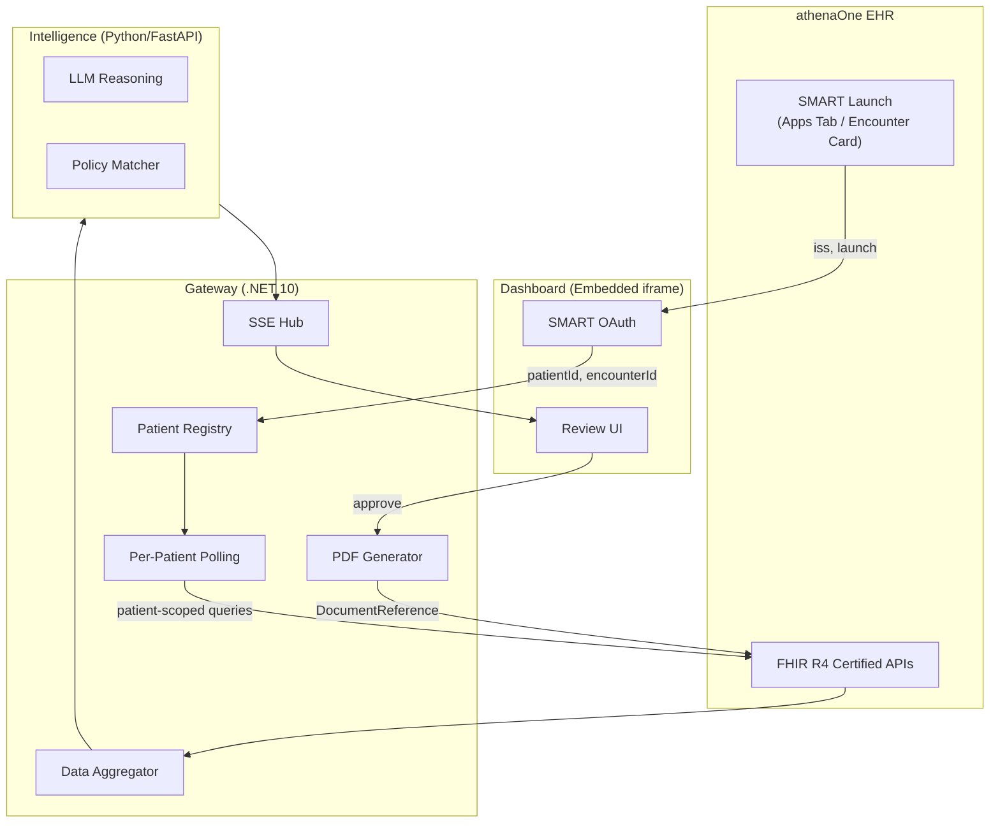
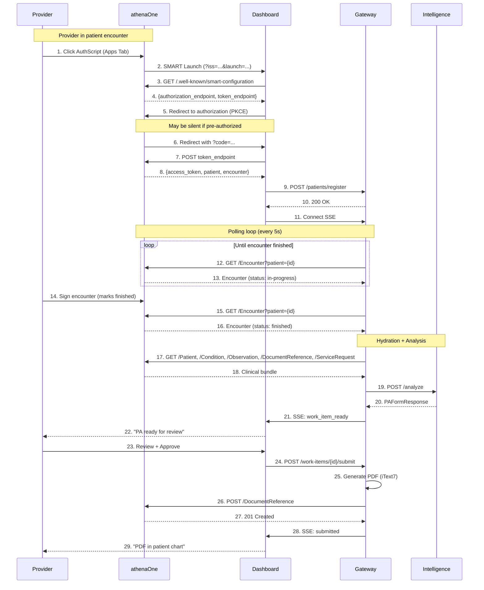

# Design: athenahealth Pivot MVP (Revised)

## Problem Statement

AuthScript must demonstrate end-to-end prior authorization automation within 6 weeks for a class project demo. Epic's App Orchard process requires 6+ months, making it incompatible with this timeline. The solution must integrate directly into an EHR workflow to prove the value proposition.

**Key Constraints:**
- 6-week timeline (class project deadline)
- Pilot practice in discussion (not confirmed)
- Certified API tier only (no premium subscriptions)
- HIPAA-compliant "pass-through" architecture (no PHI storage)

### API Constraint Discovery

During integration testing, we discovered that athenahealth's Certified FHIR R4 API **does not support global/practice-wide queries**. Every resource query requires patient-specific identifiers.

| Query Type | Supported? | Notes |
|------------|-----------|-------|
| `GET /Encounter?status=finished&date=gt{X}` | ❌ No | Requires `patient` or `_id` parameter |
| `GET /Encounter?patient={id}&status=finished` | ✅ Yes | Patient-scoped queries work |
| `GET /ServiceRequest?patient={id}` | ✅ Yes | All resources work with patient param |

**Impact:** The original "watch for new encounters" polling architecture is not possible. The system cannot discover new patients automatically—patient context must be provided through another mechanism.

> See [API Constraints Discovery](../debugging/2026-02-01-athenahealth-api-constraints.md) for full technical details.

## Chosen Approach (Revised)

**SMART on FHIR Embedded App** as the workflow trigger, building on the existing EHR-agnostic architecture. When a provider opens the AuthScript dashboard from within a patient's chart, the SMART launch provides patient context. The system then monitors that specific patient for encounter completion and triggers the PA workflow.

**Rationale:**
- athenahealth Private App bypasses Marketplace review (2 weeks vs. 6 months)
- SMART on FHIR EHR launch provides patient context automatically
- Embedded Apps documentation confirms `patientID` and `encounterID` are passed on launch
- Per-patient polling works within Certified API constraints
- Existing codebase is 90% reusable (Intelligence service unchanged, Dashboard needs SMART implementation)

**Trade-off Accepted:** The workflow is "provider-initiated" rather than fully invisible. The provider must open AuthScript once per patient to register them for monitoring. From that point forward, the PA automation is fully automatic.

## Technical Design

### System Architecture

```
┌──────────────────────────────────────────────────────────────────────────────────┐
│                              athenahealth athenaOne                              │
├──────────────────────────────────────────────────────────────────────────────────┤
│                                                                                  │
│  ┌─────────────────┐           ┌─────────────────┐      ┌──────────────────────┐ │
│  │   SMART Launch  │  OAuth    │    Gateway      │      │    Intelligence      │ │
│  │   (Apps Tab /   │─────────► │   (.NET 10)     │◄────►│   (Python/FastAPI)   │ │
│  │   Encounter     │           │                 │      │                      │ │
│  │   Card)         │           │  ┌───────────┐  │      │  ┌────────────────┐  │ │
│  └─────────────────┘           │  │ Patient   │  │      │  │ LLM Reasoning  │  │ │
│          │                     │  │ Registry  │  │      │  │ (GPT-4.1)      │  │ │
│          │ patientId           │  └───────────┘  │      │  └────────────────┘  │ │
│          │ encounterID         │                 │      │                      │ │
│          ▼                     │  ┌───────────┐  │      │  ┌────────────────┐  │ │
│  ┌─────────────────┐           │  │ Per-Patient│  │      │  │ Policy Matcher │  │ │
│  │   Dashboard     │◄───SSE────│  │ Polling   │  │      │  └────────────────┘  │ │
│  │   (Embedded     │           │  └───────────┘  │      │                      │ │
│  │   iframe)       │           │                 │      └──────────────────────┘ │
│  └─────────────────┘           │  ┌───────────┐  │                               │
│          │                     │  │ SSE Hub   │  │                               │
│          │ approve             │  └───────────┘  │                               │
│          ▼                     │                 │                               │
│  ┌─────────────────┐           │  ┌───────────┐  │                               │
│  │   FHIR R4       │◄──────────│  │ PDF Gen   │  │                               │
│  │   Certified     │  write-   │  │ (iText7)  │  │                               │
│  │   APIs          │  back     │  └───────────┘  │                               │
│  └─────────────────┘           └─────────────────┘                               │
│                                                                                  │
└──────────────────────────────────────────────────────────────────────────────────┘
```



### Two-Token Architecture

The revised design uses two separate OAuth tokens for different purposes:

| Token | Owner | Flow | Scopes | Lifetime |
|-------|-------|------|--------|----------|
| **SMART Token** | Dashboard | Authorization Code + PKCE | `launch/patient patient/*.read openid fhirUser` | Session (browser) |
| **Backend Token** | Gateway | Client Credentials | `system/*.read system/DocumentReference.write` | Long-lived (cached) |

**Why two tokens?**
- **SMART token** is tied to user session—expires when browser closes
- **Backend token** allows Gateway to continue monitoring after Dashboard minimizes
- **Backend token** uses `system/*` scopes with `patient=X` parameter—works per API constraints

### Component Modifications

#### 1. Dashboard - SMART on FHIR Implementation

Replace the stubbed `smartAuth.ts` with real OAuth implementation:

```typescript
// lib/smartAuth.ts
export async function handleSmartLaunch(iss: string, launch: string): Promise<SmartContext> {
  // 1. Fetch SMART configuration
  const config = await fetch(`${iss}/.well-known/smart-configuration`).then(r => r.json());

  // 2. Build authorization URL with PKCE
  const codeVerifier = generateCodeVerifier();
  const codeChallenge = await generateCodeChallenge(codeVerifier);

  const authUrl = new URL(config.authorization_endpoint);
  authUrl.searchParams.set('response_type', 'code');
  authUrl.searchParams.set('client_id', ATHENA_CLIENT_ID);
  authUrl.searchParams.set('redirect_uri', REDIRECT_URI);
  authUrl.searchParams.set('scope', 'launch/patient patient/*.read openid fhirUser');
  authUrl.searchParams.set('state', generateState());
  authUrl.searchParams.set('aud', iss);
  authUrl.searchParams.set('launch', launch);
  authUrl.searchParams.set('code_challenge', codeChallenge);
  authUrl.searchParams.set('code_challenge_method', 'S256');

  // 3. Redirect (or handle in popup for iframe)
  // Note: iframe sandbox allows popups
  window.location.href = authUrl.toString();
}

export async function handleCallback(code: string): Promise<SmartContext> {
  // Exchange code for token
  const tokenResponse = await fetch(tokenEndpoint, {
    method: 'POST',
    headers: { 'Content-Type': 'application/x-www-form-urlencoded' },
    body: new URLSearchParams({
      grant_type: 'authorization_code',
      code,
      redirect_uri: REDIRECT_URI,
      client_id: ATHENA_CLIENT_ID,
      code_verifier: storedCodeVerifier,
    }),
  });

  const { access_token, patient, encounter, id_token } = await tokenResponse.json();

  return {
    accessToken: access_token,
    patientId: patient,      // e.g., "a-123.E-456789"
    encounterId: encounter,  // e.g., "a-123.Enc-987654"
    fhirBaseUrl: iss,
  };
}
```

**Patient Registration with Gateway:**

```typescript
// After SMART auth completes
async function registerPatientForMonitoring(context: SmartContext): Promise<void> {
  await fetch(`${GATEWAY_URL}/api/patients/register`, {
    method: 'POST',
    headers: { 'Content-Type': 'application/json' },
    body: JSON.stringify({
      patientId: context.patientId,
      encounterId: context.encounterId,
      practiceId: extractPracticeId(context.patientId),
    }),
  });
}
```

**Context Change Handling:**

```typescript
// Listen for athenaOne context changes (postMessage)
window.addEventListener('message', (event) => {
  if (event.origin !== 'https://athenahealth.com') return;

  if (event.data.event === 'patientContextChanged') {
    const newPatientId = event.data.updatedPatient;
    if (newPatientId) {
      // Re-register with new patient context
      registerPatientForMonitoring({ patientId: newPatientId, ... });
    }
  }
});
```

#### 2. Gateway - Patient Registry (NEW)

New service to track which patients are being monitored:

```csharp
public interface IPatientRegistry
{
    Task RegisterAsync(RegisteredPatient patient, CancellationToken ct = default);
    Task<IReadOnlyList<RegisteredPatient>> GetActiveAsync(CancellationToken ct = default);
    Task UnregisterAsync(string patientId, CancellationToken ct = default);
    Task<RegisteredPatient?> GetAsync(string patientId, CancellationToken ct = default);
}

public sealed record RegisteredPatient
{
    public required string PatientId { get; init; }
    public required string EncounterId { get; init; }
    public required string PracticeId { get; init; }
    public required DateTimeOffset RegisteredAt { get; init; }
    public DateTimeOffset? LastPolledAt { get; set; }
    public string? CurrentEncounterStatus { get; set; }
}
```

**Implementation:**

```csharp
public sealed class InMemoryPatientRegistry : IPatientRegistry
{
    private readonly ConcurrentDictionary<string, RegisteredPatient> _patients = new();
    private readonly TimeSpan _expirationTime = TimeSpan.FromHours(12);

    public Task RegisterAsync(RegisteredPatient patient, CancellationToken ct = default)
    {
        _patients[patient.PatientId] = patient;
        return Task.CompletedTask;
    }

    public Task<IReadOnlyList<RegisteredPatient>> GetActiveAsync(CancellationToken ct = default)
    {
        var cutoff = DateTimeOffset.UtcNow - _expirationTime;
        var active = _patients.Values
            .Where(p => p.RegisteredAt > cutoff)
            .ToList();
        return Task.FromResult<IReadOnlyList<RegisteredPatient>>(active);
    }

    // ... other methods
}
```

**Registration Endpoint:**

```csharp
app.MapPost("/api/patients/register", async (
    RegisterPatientRequest request,
    IPatientRegistry registry,
    CancellationToken ct) =>
{
    var patient = new RegisteredPatient
    {
        PatientId = request.PatientId,
        EncounterId = request.EncounterId,
        PracticeId = request.PracticeId,
        RegisteredAt = DateTimeOffset.UtcNow,
    };

    await registry.RegisterAsync(patient, ct);

    return Results.Ok(new { message = "Patient registered for monitoring" });
});
```

#### 3. Gateway - Revised Polling Service

Update `AthenaPollingService` to poll only registered patients:

```csharp
public sealed class AthenaPollingService : BackgroundService
{
    private readonly IPatientRegistry _registry;
    private readonly IFhirHttpClient _fhirClient;
    private readonly Channel<EncounterCompletedEvent> _encounterChannel;

    protected override async Task ExecuteAsync(CancellationToken stoppingToken)
    {
        while (!stoppingToken.IsCancellationRequested)
        {
            var patients = await _registry.GetActiveAsync(stoppingToken);

            // Poll each registered patient (with concurrency limit)
            await Parallel.ForEachAsync(
                patients,
                new ParallelOptions { MaxDegreeOfParallelism = 5, CancellationToken = stoppingToken },
                async (patient, ct) => await PollPatientEncounterAsync(patient, ct));

            await Task.Delay(TimeSpan.FromSeconds(5), stoppingToken);
        }
    }

    private async Task PollPatientEncounterAsync(RegisteredPatient patient, CancellationToken ct)
    {
        var query = $"patient={patient.PatientId}&_id={patient.EncounterId}&ah-practice={patient.PracticeId}";
        var result = await _fhirClient.SearchAsync("Encounter", query, ct);

        if (result.IsFailure) return;

        var status = ExtractEncounterStatus(result.Value);

        // Detect transition to "finished"
        if (status == "finished" && patient.CurrentEncounterStatus != "finished")
        {
            patient.CurrentEncounterStatus = status;
            await _encounterChannel.Writer.WriteAsync(
                new EncounterCompletedEvent(patient.PatientId, patient.EncounterId, patient.PracticeId),
                ct);
        }

        patient.LastPolledAt = DateTimeOffset.UtcNow;
    }
}
```

#### 4. Gateway - SSE Notification Hub

(Unchanged from original design)

```csharp
app.MapGet("/api/events", async (HttpContext ctx, CancellationToken ct) =>
{
    ctx.Response.Headers.ContentType = "text/event-stream";
    ctx.Response.Headers.CacheControl = "no-cache";

    await foreach (var notification in _channel.ReadAllAsync(ct))
    {
        await ctx.Response.WriteAsync($"data: {JsonSerializer.Serialize(notification)}\n\n");
        await ctx.Response.Body.FlushAsync(ct);
    }
});
```

#### 5. Intelligence Service

(Unchanged from original design - receives same `ClinicalBundle`, returns same `PAFormResponse`)

### Data Flow



### Embedded App Configuration

Per [athenahealth Embedded Apps documentation](../integration/embedded-apps.md):

| Setting | Value | Rationale |
|---------|-------|-----------|
| **Launch Location** | Apps Tab + A&P Encounter Card | Accessible during patient encounter |
| **Authentication** | OIDC/SMART App Launch | Standard SMART on FHIR |
| **Launch Without Patient Context** | No | App requires patient context |
| **Relaunch on Context Change** | No | Handle via postMessage instead |
| **CSP** | `default-src 'self' *.athenahealth.com` | Required for iframe |

### Certified API Mapping

| Endpoint | Use | Scope Required | Works? |
|----------|-----|----------------|--------|
| `GET /Encounter?patient={id}` | Per-patient polling | `system/Encounter.read` | ✅ |
| `GET /Patient/{id}` | Demographics | `system/Patient.read` | ✅ |
| `GET /Condition?patient={id}` | Problem list | `system/Condition.read` | ✅ |
| `GET /Observation?patient={id}` | Labs, vitals | `system/Observation.read` | ✅ |
| `GET /DocumentReference?patient={id}` | Clinical notes | `system/DocumentReference.read` | ✅ |
| `GET /ServiceRequest?patient={id}` | Orders/referrals | `system/ServiceRequest.read` | ✅ |
| `POST /DocumentReference` | PDF write-back | `system/DocumentReference.write` | ✅ |

> **Key insight:** All queries work when `patient={id}` parameter is included. The SMART launch provides this patient ID.

### Rate Limiting Strategy

**Certified API Limits:**
- Preview: 15 req/sec, 50,000 calls/day
- Production: 150 req/sec, 500,000 calls/day

**Per-Patient Polling Model:**

| Patients/Day | Poll Rate (5s interval) | Hydration Burst | Total QPS | Preview OK? |
|--------------|------------------------|-----------------|-----------|-------------|
| 10 | 2 req/s | 5 req × 10 = 50 over 5min | ~2.2 | ✅ |
| 30 | 6 req/s | 5 req × 30 = 150 over 5min | ~6.5 | ✅ |
| 50 | 10 req/s | 5 req × 50 = 250 over 5min | ~10.8 | ✅ |
| 100 | 20 req/s | 5 req × 100 = 500 over 5min | ~21.7 | ⚠️ Prod only |

**Daily Budget (Preview - 50K/day):**
- 10 patients × (12 polls/min × 60 min × 8 hours + 5 hydration) = ~57,650 calls
- Conclusion: Preview tier supports ~8-10 patients/day; production supports 100+

### Integration Points

#### Existing Code Reuse

| Component | Status | Changes Needed |
|-----------|--------|----------------|
| `ITokenAcquisitionStrategy` | Exists | None |
| `AthenaTokenStrategy` | Exists | None (backend token) |
| `IFhirClient` | Exists | None |
| `FhirDataAggregator` | Exists | None |
| `ClinicalBundle` | Exists | None |
| Intelligence service | Exists | None |
| PDF generation (iText7) | Exists | None |

#### New Components

| Component | Service | Priority |
|-----------|---------|----------|
| `IPatientRegistry` | Gateway | P0 |
| `InMemoryPatientRegistry` | Gateway | P0 |
| Patient registration endpoint | Gateway | P0 |
| Revised `AthenaPollingService` | Gateway | P0 |
| Real SMART OAuth flow | Dashboard | P0 |
| Patient registration client | Dashboard | P0 |
| Context change handler | Dashboard | P1 |
| SSE client (exists, needs wiring) | Dashboard | P1 |

### Configuration

```json
{
  "Athena": {
    "ClientId": "${ATHENA_CLIENT_ID}",
    "ClientSecret": "${ATHENA_CLIENT_SECRET}",
    "FhirBaseUrl": "https://api.platform.athenahealth.com/fhir/r4/",
    "TokenEndpoint": "https://api.platform.athenahealth.com/oauth2/token",
    "PollingIntervalSeconds": 5,
    "PracticeId": "${ATHENA_PRACTICE_ID}",
    "Scopes": [
      "system/Patient.read",
      "system/Encounter.read",
      "system/Condition.read",
      "system/Observation.read",
      "system/DocumentReference.read",
      "system/DocumentReference.write",
      "system/ServiceRequest.read"
    ]
  },
  "Dashboard": {
    "SmartClientId": "${ATHENA_SMART_CLIENT_ID}",
    "RedirectUri": "https://authscript.app/callback",
    "GatewayUrl": "https://gateway.authscript.app"
  }
}
```

## Testing Strategy

### Unit Tests

| Component | Test Focus |
|-----------|------------|
| `IPatientRegistry` | Registration, expiration, concurrent access |
| Revised `AthenaPollingService` | Per-patient polling, status transitions |
| SMART OAuth client | Token exchange, PKCE, error handling |
| Context change handler | postMessage parsing, re-registration |

### Integration Tests (Sandbox)

| Scenario | Steps |
|----------|-------|
| SMART launch flow | Launch from sandbox → complete OAuth → verify context |
| Patient registration | Register patient → verify in registry → verify polling starts |
| Encounter completion | Create encounter → sign → verify detection |
| Full pipeline | Launch → register → sign encounter → verify PA form generated |

### E2E Demo Test

1. Open sandbox patient chart in athenaOne
2. Click AuthScript in Apps Tab
3. Complete SMART OAuth (may be silent)
4. Verify patient registered in Gateway
5. Create/sign encounter for patient
6. Watch polling detect encounter completion
7. Verify PA form appears in Dashboard
8. Approve → verify PDF in patient chart

## Risk Mitigation

| Risk | Status | Mitigation |
|------|--------|------------|
| Global queries not supported | ✅ Resolved | SMART launch provides patient context |
| DocumentReference.write access | ✅ Resolved | Confirmed in Certified tier |
| Pilot access falls through | ⚠️ Active | Sandbox demo viable |
| LLM accuracy insufficient | ⚠️ Active | Unchanged from original |
| Provider adoption friction | ⚠️ New | Single click to initiate; messaging emphasizes "one click saves 30 min" |
| Context change handling | ⚠️ New | postMessage API documented; test thoroughly |

## Implementation Phases

### Phase 1: SMART Auth + Patient Registry (Week 1)
- Implement `IPatientRegistry` and in-memory backing
- Add patient registration endpoint
- Implement real SMART OAuth in Dashboard
- Verify SMART launch in athenahealth sandbox

### Phase 2: Revised Polling Service (Week 2)
- Refactor `AthenaPollingService` for per-patient polling
- Add encounter status transition detection
- Wire to existing hydration pipeline
- Unit + integration tests

### Phase 3: SSE + Dashboard Integration (Week 3)
- Wire SSE client to new event types
- Implement context change handling
- Connect review UI to live data
- Implement submit → PDF → write-back flow

### Phase 4: E2E Testing + Demo (Week 4)
- Full E2E tests in sandbox
- Create demo script
- Prepare for pilot practice deployment
- Document fallback procedures

## Success Criteria

- [ ] SMART launch completes and extracts patient context
- [ ] Patient registration persists across Dashboard sessions
- [ ] Polling detects encounter completion within 10 seconds
- [ ] PA form generates with >80% field accuracy
- [ ] PDF appears in patient chart after approval
- [ ] Full workflow completes in under 3 minutes
- [ ] Demo runs without manual intervention

## References

### athenahealth
- [Embedded Apps](../integration/embedded-apps.md)
- [Certified APIs](https://docs.athenahealth.com/api/guides/certified-apis)
- [FHIR R4 Base URLs](https://docs.athenahealth.com/api/guides/base-fhir-urls)
- [Best Practices](https://docs.athenahealth.com/api/guides/best-practices)

### Technical
- [SMART App Launch v2.0](https://hl7.org/fhir/smart-app-launch/)
- [API Constraints Discovery](../debugging/2026-02-01-athenahealth-api-constraints.md)

### Internal
- [Pivot Memo](../pitch/pivot-memo.md)
- [Architecture Proposal](../pitch/authscript-pivot-architecture-proposal.md)
- [athenahealth Workflow](2026-02-01-athenahealth-workflow.md)
