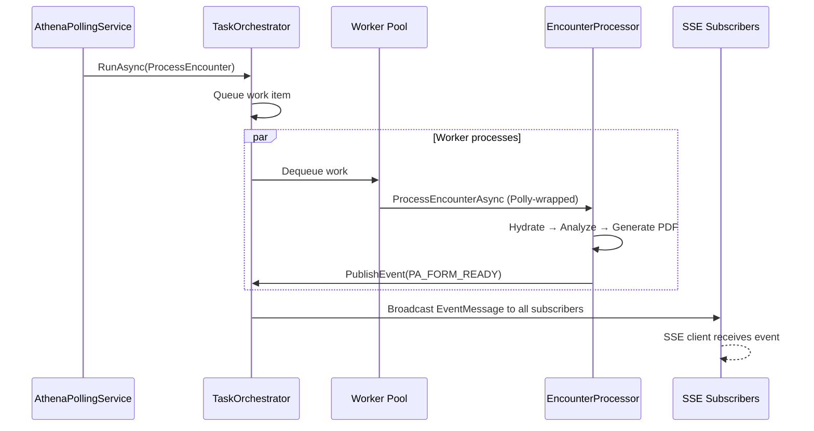

# Design: Gateway Task Orchestrator Refactor

## Problem Statement

The current athenahealth integration (PR #18) implements background encounter processing with basic patterns that lack production resilience:

| Component | Current Pattern | Limitation |
|-----------|-----------------|------------|
| `AthenaPollingService` | `BackgroundService` + unbounded `Channel<string>` | No backpressure, memory exhaustion under load |
| `EncounterProcessor` | Sequential processing, swallows errors | No retries, no parallelism, silent failures |
| `NotificationHub` | Single unbounded `Channel<Notification>` | Single consumer, slow client blocks all |

The `agentic-engine` repository contains a battle-tested `TaskOrchestrator` with Channel-based work queues, Polly resilience, multi-subscriber event broadcast, and autoscaling hooks. This refactor integrates that infrastructure to improve Gateway's production readiness.

## Chosen Approach

Port `TaskOrchestrator` and supporting types from `agentic-engine` into Gateway, adapting for prior authorization domain. The orchestrator will:

1. Replace the encounter channel with a bounded work queue
2. Wrap `EncounterProcessor.ProcessEncounterAsync` in Polly policies
3. Enable parallel encounter processing via configurable worker pool
4. Provide multi-subscriber SSE broadcast via `EventMessage` pattern

**Rationale:**
- Proven infrastructure (used in agentic-engine production)
- Minimal new code (port existing, adapt interfaces)
- Backward compatible (existing endpoints unchanged)
- Clear separation of concerns (orchestration vs. processing)

## Technical Design

### Architecture Comparison

**Current (PR #18):**
```
AthenaPollingService
    └─► Channel<string> (unbounded)
            └─► Single consumer reads encounter IDs
                    └─► EncounterProcessor (try/catch, swallow errors)
                            └─► NotificationHub.WriteAsync()
                                    └─► Single SSE reader
```

**Proposed:**
```
AthenaPollingService (detector only)
    └─► TaskOrchestrator.RunAsync(() => processor.ProcessEncounterAsync(...))
            │
            ├─► Worker 1 ─► EncounterProcessor (Polly-wrapped)
            ├─► Worker 2 ─► EncounterProcessor (Polly-wrapped)
            ├─► Worker N ─► EncounterProcessor (Polly-wrapped)
            │
            └─► EventMessage broadcast
                    ├─► SSE Subscriber 1 (Dashboard)
                    ├─► SSE Subscriber 2 (Dashboard)
                    └─► Event Logger (internal)
```

### Components to Port

From `agentic-engine/src/Agentic.Infrastructure`:

| Source | Target | Modifications |
|--------|--------|---------------|
| `Services/TaskOrchestrator.cs` | `Gateway.API/Services/Orchestration/TaskOrchestrator.cs` | Update namespace |
| `Contracts/ITaskOrchestrator.cs` | `Gateway.API/Contracts/ITaskOrchestrator.cs` | Update namespace |
| `Utilities/ResiliencyPolicyGenerator.cs` | `Gateway.API/Services/Orchestration/ResiliencyPolicyGenerator.cs` | Update namespace |
| `Configuration/ResiliencySettings.cs` | `Gateway.API/Configuration/ResiliencySettings.cs` | Already exists (merge) |
| `Enums/TaskOrchestratorFeatures.cs` | `Gateway.API/Services/Orchestration/TaskOrchestratorFeatures.cs` | Update namespace |
| `Orchestration/PollyExecutionContext.cs` | `Gateway.API/Services/Orchestration/PollyExecutionContext.cs` | Update namespace |
| `Orchestration/EventLogContext.cs` | `Gateway.API/Services/Orchestration/EventLogContext.cs` | Update namespace |

From `agentic-engine/src/Agentic.Core`:

| Source | Target | Modifications |
|--------|--------|---------------|
| `Events/EventMessage.cs` | `Gateway.API/Models/EventMessage.cs` | Update namespace |
| `Contracts/IEventStreamingCapabilities.cs` | `Gateway.API/Contracts/IEventStreamingCapabilities.cs` | Update namespace |

### Integration Points

#### 1. AthenaPollingService Changes

**Before:**
```csharp
public sealed class AthenaPollingService : BackgroundService, IEncounterPollingService
{
    private readonly Channel<string> _encounterChannel;

    // Exposes channel for external consumer
    public ChannelReader<string> Encounters => _encounterChannel.Reader;

    private async Task ProcessEncounterBundleAsync(JsonElement bundle, CancellationToken ct)
    {
        // Writes to channel
        await _encounterChannel.Writer.WriteAsync(encounterId, ct);
    }
}
```

**After:**
```csharp
public sealed class AthenaPollingService : BackgroundService, IEncounterPollingService
{
    private readonly ITaskOrchestrator _orchestrator;
    private readonly IEncounterProcessor _processor;

    private async Task ProcessEncounterBundleAsync(JsonElement bundle, CancellationToken ct)
    {
        // Enqueues processing work
        await _orchestrator.RunAsync(
            () => _processor.ProcessEncounterAsync(encounterId, patientId, ct),
            ct);
    }
}
```

#### 2. EncounterProcessor Changes

**Before:**
```csharp
public sealed class EncounterProcessor : IEncounterProcessor
{
    public async Task ProcessEncounterAsync(string encounterId, string patientId, CancellationToken ct)
    {
        try
        {
            // Processing steps...
            await _notificationHub.WriteAsync(notification, ct);
        }
        catch (HttpRequestException ex)
        {
            _logger.LogError(ex, "Service error...");
            // Error swallowed
        }
    }
}
```

**After:**
```csharp
public sealed class EncounterProcessor : IEncounterProcessor
{
    private readonly ITaskOrchestrator _orchestrator;

    public async Task ProcessEncounterAsync(string encounterId, string patientId, CancellationToken ct)
    {
        var correlationId = $"enc-{encounterId}";

        // Publish start event
        _orchestrator.PublishEvent(EventMessage.Create(
            eventType: "EncounterProcessingStarted",
            correlationId: correlationId,
            data: new { encounterId, patientId },
            source: "EncounterProcessor"));

        // Processing steps... (errors propagate for Polly retry)

        // Publish completion event (replaces NotificationHub)
        _orchestrator.PublishEvent(EventMessage.Create(
            eventType: "PA_FORM_READY",
            correlationId: correlationId,
            data: notification,
            source: "EncounterProcessor"));
    }
}
```

#### 3. NotificationHub Replacement

**Before:**
```csharp
// Single-consumer pattern
public interface INotificationHub
{
    Task WriteAsync(Notification notification, CancellationToken ct);
    IAsyncEnumerable<Notification> ReadAllAsync(CancellationToken ct);
}
```

**After:**
```csharp
// Multi-subscriber pattern via TaskOrchestrator
app.MapGet("/api/events", async (
    ITaskOrchestrator orchestrator,
    HttpContext ctx,
    CancellationToken ct) =>
{
    ctx.Response.Headers.ContentType = "text/event-stream";
    ctx.Response.Headers.CacheControl = "no-cache";

    await foreach (var eventMessage in orchestrator.GetEventStreamAsync(ct))
    {
        var json = JsonSerializer.Serialize(eventMessage);
        await ctx.Response.WriteAsync($"data: {json}\n\n", ct);
        await ctx.Response.Body.FlushAsync(ct);
    }
});
```

#### 4. DI Registration

```csharp
public static class DependencyExtensions
{
    public static IServiceCollection AddTaskOrchestrator(
        this IServiceCollection services,
        IConfiguration configuration)
    {
        services.Configure<TaskOrchestratorOptions>(
            configuration.GetSection("TaskOrchestrator"));

        services.AddSingleton<ITaskOrchestrator>(sp =>
        {
            var logger = sp.GetRequiredService<ILogger<TaskOrchestrator>>();
            var options = sp.GetRequiredService<IOptions<TaskOrchestratorOptions>>().Value;

            return new TaskOrchestrator(
                logger,
                features: TaskOrchestratorFeatures.BlockOnFullQueue,
                workerCount: options.WorkerCount,
                maxBacklog: options.MaxBacklog,
                subscriberChannelCapacity: options.SubscriberChannelCapacity);
        });

        return services;
    }
}
```

### Configuration

```json
{
  "TaskOrchestrator": {
    "WorkerCount": 2,
    "MaxBacklog": 128,
    "SubscriberChannelCapacity": 1000,
    "Resiliency": {
      "RetryCount": 3,
      "RetryIntervalSeconds": 2,
      "UseExponentialBackoff": true,
      "TimeoutIntervalSeconds": 60
    }
  }
}
```

### Data Flow



### Resilience Behavior

| Scenario | Current Behavior | With TaskOrchestrator |
|----------|------------------|----------------------|
| FHIR API timeout | Error logged, processing stops | Retry with exponential backoff (3 attempts) |
| Intelligence service 503 | Error logged, processing stops | Retry after 2s, 4s, 8s delays |
| Queue full (burst load) | Unbounded growth (OOM risk) | Backpressure: `RunAsync` awaits capacity |
| Slow SSE client | Blocks all notification delivery | Per-subscriber channels with drop-oldest |
| Graceful shutdown | Immediate termination | Drain queue with 30s timeout |

### Event Types

| Event Type | When Published | Data |
|------------|----------------|------|
| `EncounterDetected` | Polling finds finished encounter | `{ encounterId, patientId }` |
| `EncounterProcessingStarted` | Worker picks up encounter | `{ encounterId, patientId, workerId }` |
| `ClinicalDataHydrated` | FHIR aggregation complete | `{ encounterId, conditionCount, observationCount }` |
| `IntelligenceAnalysisComplete` | LLM reasoning done | `{ encounterId, recommendation, confidence }` |
| `PdfGenerated` | PDF stamped | `{ encounterId, pdfSizeBytes }` |
| `PA_FORM_READY` | Full pipeline complete | `{ transactionId, encounterId, patientId, message }` |
| `EncounterProcessingFailed` | All retries exhausted | `{ encounterId, error, attemptCount }` |

### Breaking Changes

| Change | Impact | Migration |
|--------|--------|-----------|
| `INotificationHub` deprecated | SSE endpoint consumers | Use `ITaskOrchestrator.GetEventStreamAsync()` |
| `NotificationHub.WriteAsync` removed | `EncounterProcessor` | Use `ITaskOrchestrator.PublishEvent()` |
| `Notification` record replaced | SSE event shape changes | Use `EventMessage` with same fields in `Data` |

### Backward Compatibility

The SSE endpoint (`/api/events`) can maintain the same external contract by transforming `EventMessage` to `Notification`:

```csharp
await foreach (var eventMessage in orchestrator.GetEventStreamAsync(ct))
{
    // Transform to legacy format if eventType matches notification
    if (eventMessage.EventType == "PA_FORM_READY" && eventMessage.Data is Notification n)
    {
        await ctx.Response.WriteAsync($"data: {JsonSerializer.Serialize(n)}\n\n", ct);
    }
}
```

## Testing Strategy

### Unit Tests

| Component | Test Focus |
|-----------|------------|
| `TaskOrchestrator` | Work queuing, worker lifecycle, event broadcast |
| `ResiliencyPolicyGenerator` | Retry delays, circuit breaker transitions |
| `EncounterProcessor` | Event publishing, error propagation |

### Integration Tests

| Scenario | Verification |
|----------|--------------|
| Parallel processing | Multiple encounters processed concurrently |
| Retry behavior | Transient failure retried, success on attempt 2 |
| Backpressure | Queue full → `RunAsync` blocks until capacity |
| SSE broadcast | Multiple clients receive same event |
| Graceful shutdown | Queue drains before termination |

## Implementation Plan

### Phase 1: Port Infrastructure (Day 1)
- [ ] Copy `TaskOrchestrator.cs` and dependencies
- [ ] Update namespaces and resolve build errors
- [ ] Add unit tests for ported code
- [ ] Verify build passes

### Phase 2: Integration (Day 2)
- [ ] Update `AthenaPollingService` to use `ITaskOrchestrator`
- [ ] Update `EncounterProcessor` to publish events
- [ ] Wire DI registration
- [ ] Update configuration schema

### Phase 3: SSE Migration (Day 3)
- [ ] Update `/api/events` endpoint to use `GetEventStreamAsync`
- [ ] Deprecate `INotificationHub`
- [ ] Update Dashboard SSE client if needed
- [ ] Backward compatibility layer if required

### Phase 4: Validation (Day 4)
- [ ] Integration tests for parallel processing
- [ ] Load test with simulated burst
- [ ] E2E test with sandbox
- [ ] Documentation update

## Dependencies

### NuGet Packages

| Package | Purpose |
|---------|---------|
| `Polly` | Resilience policies (already in project) |
| `System.Threading.Channels` | Bounded work queue (built-in) |

### No New Dependencies

The `TaskOrchestrator` uses only:
- `System.Threading.Channels` (built-in)
- `Polly` (already referenced)
- `Microsoft.Extensions.Logging` (already referenced)

## Risk Mitigation

| Risk | Probability | Impact | Mitigation |
|------|-------------|--------|------------|
| Port introduces bugs | Low | Medium | Extensive unit tests, code review |
| Performance regression | Low | High | Load test before/after |
| SSE contract breaks Dashboard | Medium | High | Backward compat layer |
| Polly overhead measurable | Low | Low | Benchmark critical path |

## Success Criteria

- [ ] Transient FHIR/Intelligence failures automatically retry (observe in logs)
- [ ] Multiple encounters process in parallel (verify with trace correlation)
- [ ] Queue backpressure prevents OOM under load (stress test)
- [ ] Multiple SSE clients receive all events (manual test with 2 browsers)
- [ ] Graceful shutdown drains queue (verify in container restart)
- [ ] No breaking changes to Dashboard SSE client

## References

### Source Code
- [`agentic-engine/TaskOrchestrator.cs`](~/Documents/code/lvlup-sw/agentic-engine/src/Agentic.Infrastructure/Services/TaskOrchestrator.cs)
- [`agentic-engine/ITaskOrchestrator.cs`](~/Documents/code/lvlup-sw/agentic-engine/src/Agentic.Infrastructure/Contracts/ITaskOrchestrator.cs)
- [`agentic-engine/ResiliencyPolicyGenerator.cs`](~/Documents/code/lvlup-sw/agentic-engine/src/Agentic.Infrastructure/Utilities/ResiliencyPolicyGenerator.cs)
- [`agentic-engine/EventMessage.cs`](~/Documents/code/lvlup-sw/agentic-engine/src/Agentic.Core/Events/EventMessage.cs)

### Internal
- [athenahealth Pivot MVP Design](2026-01-29-athenahealth-pivot-mvp.md)
- [PR #18: athenahealth Integration](https://github.com/lvlup-sw/authscript/pull/18)
