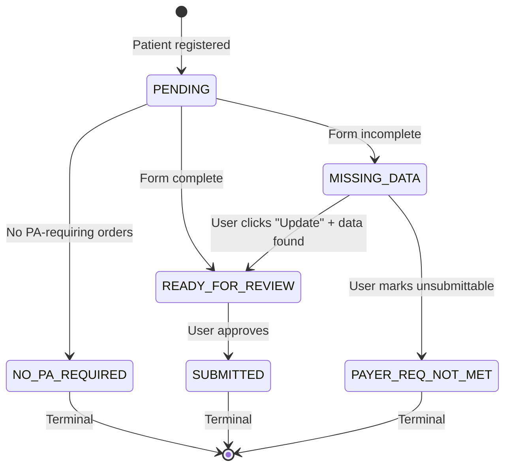
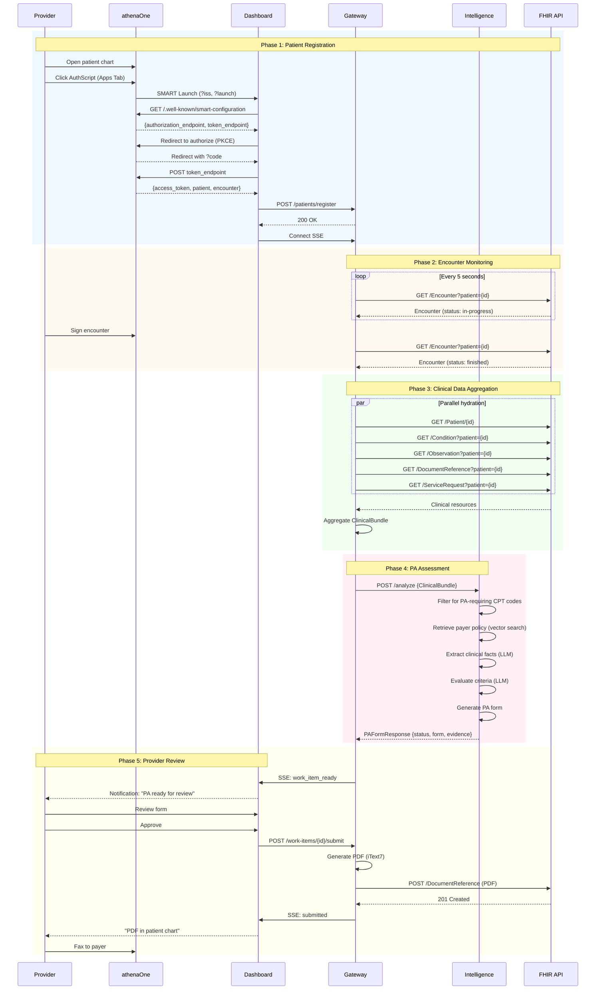

# AuthScript Workflow: athenahealth Integration

This document describes the validated end-to-end workflow for AuthScript integration with athenahealth's athenaOne EHR, using SMART on FHIR embedded apps and the Certified FHIR R4 API tier.

> **Related:** [Design Document](2026-01-29-athenahealth-pivot-mvp.md) | [API Constraints](../debugging/2026-02-01-athenahealth-api-constraints.md)

---

## Legend

| Symbol | Category | Description |
|--------|----------|-------------|
| **🟡** | System Actions | Automated backend processes (not visible to user) |
| **🟢** | AI Agent Actions | Intelligent processing, checking, and drafting |
| **🔵** | User Actions | Manual reviews, edits, and decisions by the provider |
| **🟣** | Decision/Monitor | Decision points and terminal states |
| **⚪** | Context/Notes | Implementation details and clarifications |

---

## Phase 1: Patient Registration (Provider-Initiated)

### Trigger: Provider Opens AuthScript

> **Key Insight:** athenahealth's Certified API does not support global encounter discovery. The workflow is initiated when a provider opens AuthScript from within a patient's chart.

1. **🔵 Provider:** Opens patient chart in athenaOne
   - ⚪ *Provider is seeing a patient who may need a procedure requiring prior authorization*

2. **🔵 Provider:** Clicks AuthScript in Apps Tab or A&P Encounter Card
   - ⚪ *Launch locations per [Embedded Apps documentation](../integration/embedded-apps.md)*
   - ⚪ *Can also launch from App Dock if already on patient page*

3. **🟡 System:** SMART on FHIR EHR Launch
   - ⚪ *athenaOne opens AuthScript in iframe with `?iss=...&launch=...` parameters*
   - ⚪ *Dashboard receives FHIR base URL and opaque launch token*

4. **🟡 System:** OAuth 2.0 Authorization Flow (PKCE)
   - ⚪ *Fetch `.well-known/smart-configuration` for endpoints*
   - ⚪ *Redirect to authorization endpoint (may be silent if pre-authorized)*
   - ⚪ *Exchange authorization code for access token*

5. **🟡 System:** Extract patient context from token response
   - ⚪ *Token response includes: `patient`, `encounter`, `access_token`*
   - ⚪ *Patient ID format: `a-{tenant}.E-{patientId}` (e.g., `a-123.E-456789`)*

6. **🟡 System:** Register patient with Gateway for monitoring
   - ⚪ *POST `/api/patients/register` with patientId, encounterId, practiceId*
   - ⚪ *Gateway adds patient to monitoring queue*

7. **🟡 System:** Display patient context in Dashboard
   - ⚪ *Show patient name, DOB, encounter date*
   - ⚪ *Connect to SSE endpoint for real-time updates*

---

## Phase 2: Encounter Monitoring (Automated)

### Background Polling Loop

> **Constraint:** Polling uses patient-scoped queries (`?patient={id}`) which work in the Certified API tier.

1. **🟡 System:** Poll for encounter status change
   - ⚪ *GET `/Encounter?patient={id}&_id={encounterId}&ah-practice={practiceId}`*
   - ⚪ *Poll interval: 5 seconds*
   - ⚪ *Continues until encounter status = "finished"*

2. **🟣 Decision:** Is encounter status "finished"?
   - **IF NO:** Continue polling
   - **IF YES:** Proceed to Phase 3

3. **🟡 System:** Detect encounter completion
   - ⚪ *Transition from "in-progress" → "finished" triggers hydration*
   - ⚪ *Unregister patient from active polling (move to processing queue)*

---

## Phase 3: Clinical Data Aggregation (Automated)

### Hydration: Fetch All Relevant Clinical Data

> **Constraint:** All queries include `patient={id}` parameter as required by athenahealth API.

1. **🟡 System:** Fetch Patient demographics
   - ⚪ *GET `/Patient/{id}`*
   - ⚪ *Extract: name, DOB, gender, address, insurance*

2. **🟡 System:** Fetch Conditions (problem list)
   - ⚪ *GET `/Condition?patient={id}`*
   - ⚪ *Extract: ICD-10 codes, descriptions, onset dates*

3. **🟡 System:** Fetch Observations (labs, vitals)
   - ⚪ *GET `/Observation?patient={id}`*
   - ⚪ *Extract: recent lab results, vital signs with dates*

4. **🟡 System:** Fetch DocumentReference (clinical notes)
   - ⚪ *GET `/DocumentReference?patient={id}`*
   - ⚪ *Extract: progress notes, consult notes, imaging reports*

5. **🟡 System:** Fetch ServiceRequest (orders/referrals)
   - ⚪ *GET `/ServiceRequest?patient={id}`*
   - ⚪ *Extract: CPT codes, procedure descriptions, ordering provider*

6. **🟡 System:** Aggregate into ClinicalBundle
   - ⚪ *Combine all resources into unified data structure*
   - ⚪ *Pass to Intelligence service for analysis*

---

## Phase 4: PA Assessment (AI-Powered)

### Determine if PA is Required and Generate Form

1. **🟢 AI Agent:** Filter ServiceRequests for PA-requiring CPT codes
   - ⚪ *Check CPT codes against known PA-required list*
   - ⚪ *Consider payer-specific requirements*

2. **🟣 Decision:** Does patient have any PA-requiring orders?
   - **IF NO:**
     - **🟡 System:** Mark work item as `NO_PA_REQUIRED` *(Terminal State)*
     - **🟡 System:** SSE notification to Dashboard
     - ⚪ *Dashboard shows "No prior authorization needed"*
   - **IF YES:** Proceed to policy retrieval

3. **🟢 AI Agent:** Retrieve matching payer policy
   - ⚪ *Vector search (pgvector) for relevant policy based on CPT + payer*
   - ⚪ *Extract policy criteria and required evidence*

4. **🟢 AI Agent:** Extract clinical facts from bundle
   - ⚪ *LLM extracts structured facts: diagnoses, treatments, medications, labs*
   - ⚪ *Each fact includes source citation (FHIR resource ID or note date)*

5. **🟢 AI Agent:** Evaluate facts against policy criteria
   - ⚪ *For each criterion: determine MET / NOT_MET / UNCLEAR*
   - ⚪ *Link supporting evidence to each criterion*
   - ⚪ *Generate reasoning explanation*

6. **🟢 AI Agent:** Generate PA form with evidence citations
   - ⚪ *Map extracted facts to form fields*
   - ⚪ *Include clinical summary and supporting documentation*

7. **🟢 AI Agent:** Check form for completeness
   - ⚪ *Verify all required fields populated*
   - ⚪ *Identify any missing required information*

8. **🟣 Decision:** Is form complete?
   - **IF YES:**
     - **🟡 System:** Create work item with status `READY_FOR_REVIEW`
     - **🟡 System:** SSE notification to Dashboard
   - **IF NO:**
     - **🟡 System:** Create work item with status `MISSING_DATA`
     - **🟡 System:** SSE notification with list of missing fields

---

## Phase 5: Provider Review (User Interaction)

### Path A: Ready for Review

> Form is complete. Provider reviews for accuracy before submission.

1. **🟡 System:** SSE notification: work item ready
   - ⚪ *Dashboard displays notification badge*
   - ⚪ *Work item appears in "Ready for Review" queue*

2. **🔵 Provider:** Review pre-filled PA form
   - ⚪ *Dashboard shows form with all fields populated*
   - ⚪ *Evidence panel shows source citations for each field*
   - ⚪ *Confidence meter indicates overall accuracy*

3. **🟣 Decision:** Is the form accurate and complete?
   - **IF NO:**
     - **🔵 Provider:** Edit fields manually
     - ⚪ *Inline editing of any field*
     - ⚪ *Proceed to approval after edits*
   - **IF YES:** Proceed to approval

4. **🔵 Provider:** Approve form for submission
   - ⚪ *Click "Approve" button*
   - ⚪ *Triggers PDF generation and write-back*

5. **🟡 System:** Generate PDF (iText7)
   - ⚪ *Stamp form with patient info, date, provider signature line*

6. **🟡 System:** Write PDF to patient chart
   - ⚪ *POST `/DocumentReference` with Base64-encoded PDF*
   - ⚪ *Document appears in patient's chart in athenaOne*

7. **🟡 System:** Update work item status to `SUBMITTED`
   - ⚪ *SSE notification confirms submission*

8. **🔵 Provider:** Fax to payer from athenaOne
   - ⚪ *Open DocumentReference in athenaOne*
   - ⚪ *Use athenaOne's built-in fax functionality*
   - ⚪ *Manual step (MVP scope does not include auto-fax)*

---

### Path B: Missing Data

> Form is incomplete. Provider must provide additional information or mark as unsubmittable.

1. **🟡 System:** SSE notification: missing data
   - ⚪ *Dashboard displays notification with warning indicator*
   - ⚪ *Work item appears in "Missing Data" queue*

2. **🔵 Provider:** Review what data is missing
   - ⚪ *Dashboard shows which fields are incomplete*
   - ⚪ *Explains what evidence is needed (per payer policy)*

3. **🟣 Decision:** Can the missing data be provided?
   - **IF NO (Cannot provide data):**
     - **🔵 Provider:** Click "Payer Requirements Not Met"
     - **🟡 System:** Update work item status to `PAYER_REQ_NOT_MET` *(Terminal State)*
     - ⚪ *Work item archived with reason noted*
   - **IF YES (Can provide data):**
     - **🔵 Provider:** Click "Update with New Data"
     - ⚪ *Provider has added documentation to patient chart*
     - Proceed to re-hydration

4. **🟡 System:** Re-fetch clinical data from EHR
   - ⚪ *Repeat Phase 3 hydration steps*
   - ⚪ *Look for new DocumentReference, Observation entries*

5. **🟢 AI Agent:** Re-evaluate with new data
   - ⚪ *Re-run criteria evaluation*
   - ⚪ *Update form with newly available evidence*

6. **→ Loop:** Return to Phase 4 Step 7 (completeness check)
   - ⚪ *May result in READY_FOR_REVIEW or still MISSING_DATA*

---

## Work Item State Machine



### State Descriptions

| State | Description | User Actions Available |
|-------|-------------|----------------------|
| `PENDING` | Patient registered, awaiting encounter completion | None (monitoring) |
| `NO_PA_REQUIRED` | AI determined no orders need PA | None (auto-closed) |
| `READY_FOR_REVIEW` | Form complete, awaiting approval | Review, Edit, Approve |
| `MISSING_DATA` | Required fields incomplete | "Update with New Data", "Payer Req Not Met" |
| `SUBMITTED` | PDF written to chart | None (user faxes manually) |
| `PAYER_REQ_NOT_MET` | User marked as unsubmittable | None (archived) |

---

## Complete Sequence Diagram



---

## Timing Expectations

| Phase | Expected Duration | Notes |
|-------|-------------------|-------|
| Phase 1: Registration | 1-5 seconds | OAuth may be silent if pre-authorized |
| Phase 2: Monitoring | Variable | Depends on encounter duration; polls every 5s |
| Phase 3: Hydration | 2-5 seconds | Parallel FHIR requests, ~5 resources |
| Phase 4: AI Analysis | 10-30 seconds | LLM processing time |
| Phase 5: Review | Variable | Depends on provider; edit time if needed |
| **Total automated** | **15-45 seconds** | From encounter close to PA form ready |

---

## Error Handling

### SMART Launch Failures

| Error | Handling |
|-------|----------|
| Missing `iss` or `launch` params | Show error, link to retry from athenaOne |
| OAuth authorization denied | Show explanation, offer retry |
| Token exchange failed | Log error, show retry option |
| Patient context not in token | Show error, may indicate wrong app configuration |

### Polling Failures

| Error | Handling |
|-------|----------|
| 401 Unauthorized | Refresh backend token, retry |
| 429 Rate Limited | Exponential backoff, log warning |
| 5xx Server Error | Retry with backoff, alert after 3 failures |
| Network timeout | Retry, log warning |

### Analysis Failures

| Error | Handling |
|-------|----------|
| No PA-requiring orders found | Mark as `NO_PA_REQUIRED`, notify user |
| No matching policy found | Use generic form, note "policy not found" |
| LLM timeout | Retry once, then mark as needs manual review |
| Insufficient clinical data | Mark as `MISSING_DATA` with specific gaps |

### Write-back Failures

| Error | Handling |
|-------|----------|
| 401 Unauthorized | Refresh token, retry |
| 400 Invalid DocumentReference | Log details, show error to user |
| 413 Payload Too Large | Compress PDF, retry |
| 5xx Server Error | Queue for retry, notify user |

---

## Appendix: athenahealth-Specific Details

### Patient ID Format

athenahealth patient IDs follow the pattern: `a-{tenant}.E-{patientId}`

- `a-` prefix indicates athenahealth
- `{tenant}` is the practice/organization ID
- `E-` indicates patient resource type
- `{patientId}` is the numeric patient ID

Example: `a-123.E-456789`

### Practice ID Parameter

All FHIR queries must include the `ah-practice` parameter:

```
GET /Encounter?patient={id}&ah-practice=Organization/a-1.Practice-{practiceId}
```

### Encounter ID Format

Encounter IDs follow: `a-{tenant}.Enc-{encounterId}`

Example: `a-123.Enc-987654`

### Rate Limits

| Environment | QPS | Daily Limit |
|-------------|-----|-------------|
| Preview | 15 | 50,000 |
| Production | 150 | 500,000 |

---

## References

- [Design Document](2026-01-29-athenahealth-pivot-mvp.md)
- [Embedded Apps Documentation](../integration/embedded-apps.md)
- [API Constraints Discovery](../debugging/2026-02-01-athenahealth-api-constraints.md)
- [SMART App Launch v2.0](https://hl7.org/fhir/smart-app-launch/)
